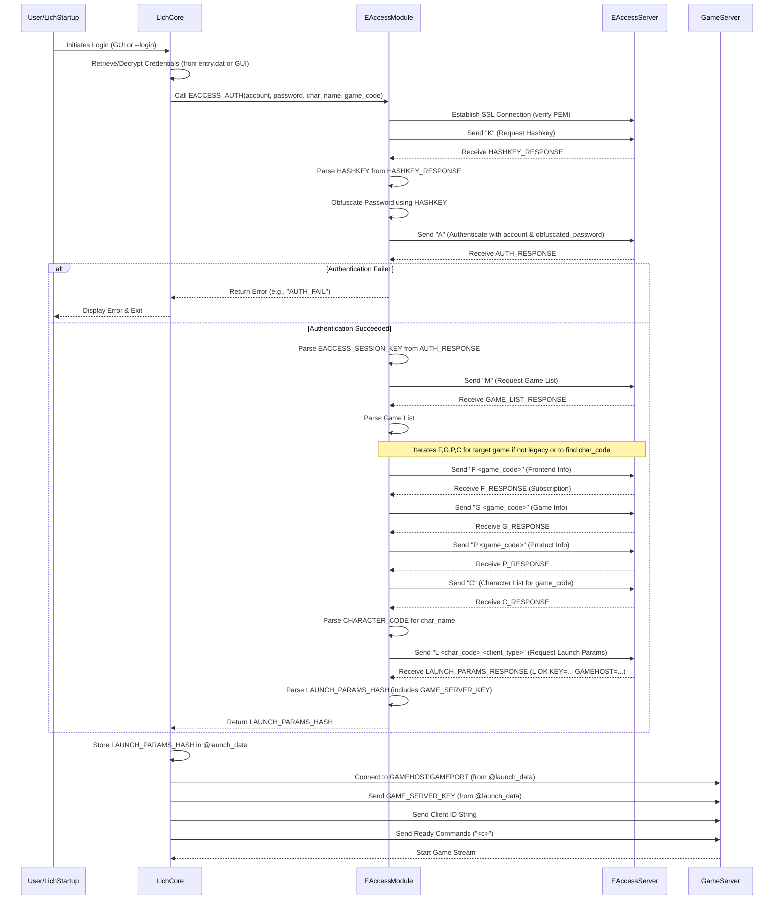

# Lich EAccess Authentication Workflow - Technical Documentation

## 1. High-Level Overview

### 1.1. Purpose
This document outlines the high-level workflow Lich uses to authenticate a user's Simutronics game account and select a character for play. This process primarily involves interaction with Simutronics' EAccess authentication servers and results in obtaining a session-specific **Game Server Key (`authKey`)** and other launch parameters required to connect to the actual game server (e.g., `storm.gs4.game.play.net`).

### 1.2. Main Workflow
The authentication workflow is typically triggered in one of several ways:
1.  **GUI Login:** The user enters credentials and selects a character/game in Lich's graphical interface.
2.  **Command-Line Login (`--login`):** Lich is started with arguments specifying the character and game, using saved credentials.
3.  **.SAL File Launch:** Lich is launched with a `.sal` file, which contains pre-authenticated session information.

Regardless of the trigger, if Lich needs to perform authentication itself (i.e., not using a pre-filled `.sal` file), it will execute a series of steps involving communication with the EAccess servers.

### 1.3. Key Entry Points & Components
*   **Lich Main Logic (`main/main.rb`):** Initiates the login process based on startup arguments or GUI interaction.
*   **`Lich::Common::EAccess.auth` (`lib/common/eaccess.rb`):** The core Ruby method responsible for the entire EAccess protocol communication.
*   **`Lich::Common::Account` (`lib/common/account.rb`):** A module to store account-level information once fetched (though less directly involved in the auth *protocol* itself, it's where results might be stored).
*   **`entry.dat` (`DATA_DIR/entry.dat`):** Encrypted storage for saved login profiles used by the GUI and `--login`.
*   **`.sal` files:** External files containing pre-fetched launch parameters, including the game server key.

## 2. Code Flow & Architecture

### 2.1. Primary Flow of Execution (Lich-Initiated EAccess Authentication)

The following describes the flow when Lich actively authenticates with EAccess servers (e.g., via GUI or `--login`).



**Architectural Bullet List:**

*   **Client-Server (Lich <-> EAccess):** Lich acts as a client to the Simutronics EAccess authentication servers.
*   **Protocol-Driven:** Communication follows a specific sequence of commands (`K`, `A`, `M`, `F`, `G`, `P`, `C`, `L`) and expected responses.
*   **Stateful (within EAccess session):** The EAccess server maintains session state tied to the initial authentication.
*   **Key Generation:** The critical `authKey` (game server key) is generated by the EAccess server during the `L` command interaction.
*   **Separation of Concerns:**
    *   **EAccess (`common/eaccess.rb`):** Handles the low-level SSL connection and EAccess protocol.
    *   **Login Logic (`main/main.rb`, `common/gui-login.rb`):** Orchestrates when and how `EAccess.auth` is called, using stored or user-provided credentials.

### 2.2. Significant Components & Responsibilities

*   **`Lich::Common::EAccess.auth(account, password, character, game_code)`:**
    *   **Responsibility:** Orchestrates the entire authentication and launch parameter retrieval process with the EAccess servers.
    *   **Key Steps:**
        1.  Establishes a secure SSL connection to the EAccess server (`eaccess.play.net:7910`).
        2.  Verifies the server's SSL certificate against a local `simu.pem` file (downloads/updates it if necessary).
        3.  **`K` command:** Sends "K\n" to request an encryption hashkey.
        4.  **Password Obfuscation:** Receives the hashkey and uses it to obfuscate the user's plain-text password. This is a simple XOR-based obfuscation, not strong encryption.
        5.  **`A` command:** Sends "A\t`<account_name>`\t`<obfuscated_password>`\n" to authenticate.
        6.  **Key Extraction:** Parses the response. If successful, it expects a line starting with `KEY\t...`, from which it extracts an EAccess session key (distinct from the final game server key).
        7.  **`M` command:** Sends "M\n" to get a list of games associated with the account.
        8.  **`F`, `G`, `P`, `C` commands (Iterative or specific):**
            *   `F\t<game_code>\n`: Selects the game frontend type and gets subscription status.
            *   `G\t<game_code>\n`: Gets game-specific information.
            *   `P\t<game_code>\n`: Gets product-specific information.
            *   `C\n`: Gets the character list for the currently selected `game_code`. The response is parsed to find the `charCode` (a numerical or short-string identifier) for the target `character` name.
        9.  **`L` command:** Sends "L\t`<char_code>`\t`<CLIENT_TYPE>`\n" (e.g., `CLIENT_TYPE` could be "STORM", "WIZ"). This is the request for the final launch parameters for the specific character.
        10. **Launch Parameter Parsing:** Parses the response from the `L` command, which, if successful, starts with `L\tOK\t`. The subsequent tab-delimited key-value pairs (e.g., `KEY=...`, `GAMEHOST=...`, `GAMEPORT=...`) are extracted.
            *   The **`KEY`** value obtained here is the crucial **`authKey`** used to connect to the actual game server.
        11. Returns a hash of these launch parameters.

*   **Login Orchestration Logic (in `main/main.rb` and `common/gui-login.rb`):**
    *   **Responsibility:** Gathers necessary credentials (username, password, character name, game code) either from command-line arguments, the `entry.dat` file, or GUI input.
    *   Calls `Lich::Common::EAccess.auth` with these credentials.
    *   Stores the returned launch parameters (including the game server `authKey`) in the `@launch_data` instance variable.
    *   Uses `@launch_data` to subsequently connect to the game server and initiate the game session.

## 3. Database Connections & Models

The EAccess authentication process itself does **not** directly use `lich.db3` or `infomon.db` *during* the authentication exchange with Simutronics servers.

However, it interacts with file-based data:

*   **`DATA_DIR/entry.dat`:**
    *   **Read:** If logging in via the GUI's "Saved Entry" tab or via the `--login` command-line argument, Lich reads this file to retrieve previously saved (and encrypted) account credentials and character preferences.
    *   **Write:** If the user saves a new login profile through the GUI's "Manual Entry" tab and checks "Save this info", Lich writes to this file.
*   **`DATA_DIR/simu.pem`:**
    *   **Read/Write:** Used to store and verify the SSL certificate of the EAccess server. If it's missing or doesn't match the server's current certificate, Lich attempts to download and save/overwrite it.

## 4. File I/O
*   **`DATA_DIR/entry.dat`:** (As described in Database Connections)
*   **`DATA_DIR/simu.pem`:** (As described in Database Connections)

## 5. Configuration
Configuration relevant to EAccess login comes from:
*   **Command-Line Arguments:**
    *   `--login <CharacterName>`: Triggers EAccess using saved details for `<CharacterName>`.
    *   `--gemstone`, `--platinum`, `--shattered`, `--test` (and DR equivalents): Help select the correct `game_code` and saved profile from `entry.dat` or influence `EAccess.auth` parameters.
    *   `--account=<id>`, `--password=<pw>`, `--character=<name>`, `--game=<gamecode>`: Can be used by scripts or advanced users to provide credentials directly, bypassing `entry.dat` (less common for manual EAccess).
*   **`DATA_DIR/entry.dat`:** Contains saved user IDs, (encrypted) passwords, character names, game codes, and preferred frontends.
*   **Lich GUI Input:** When using the "Manual Entry" tab, the user provides account ID, password, character name, and selects game/instance directly into the GUI fields.

## 6. Recurring Tasks
The EAccess authentication process is **not** a recurring task. It's a one-time procedure executed during the initial login phase to obtain a session key for a single game session. This session key typically has an expiration time.

## 7. Other Important Logic

### 7.1. Password Obfuscation
*   The password is not sent in plain text over the SSL connection to EAccess.
*   The EAccess server first provides a `HASHKEY` (in response to the `K` command).
*   Each byte of the password (after subtracting 32) is XORed with the corresponding byte of the `HASHKEY`, and then 32 is added back. This obfuscated version is sent.
    ```
    obfuscated_char_byte = ((password_byte - 32) XOR hashkey_byte) + 32
    ```
*   This is a simple obfuscation, not strong encryption. The security relies primarily on the SSL tunnel.

### 7.2. Error Handling
*   The `EAccess.auth` method checks the server's responses at critical junctures (e.g., after sending credentials, after requesting launch parameters).
*   If an unexpected response or an error code is received from the EAccess server (e.g., "AUTH_FAIL", "BAD_PASS", "NO_GAME"), the method typically returns an error indicator (like the error string itself) or raises an exception.
*   The calling code (in `main/main.rb` or GUI logic) then handles this by displaying an error message to the user and usually terminating the login attempt.
*   SSL connection errors or certificate validation issues (if strict validation were enforced beyond the PEM check) would also lead to login failure.

### 7.3. Session Key (`authKey`)
*   The **`KEY`** value returned by the `L` command from the EAccess server is the critical piece of information.
*   This `KEY` is the session-specific token that the *game server* (e.g., `storm.gs4.game.play.net`) uses to validate the client and log in the correct character.
*   It encapsulates the authenticated account and the chosen character for that specific game session.

### 7.4. Client Type (`STORM`, `WIZ`, `AVALON`)
*   When requesting the final launch parameters (`L` command), Lich specifies a client type (e.g., "STORM", "WIZ").
*   The EAccess server may tailor parts of its response (like `GAMEFILE` or certain flags within the `KEY`) based on this client type, although the core `KEY` structure for authentication with the game server is generally similar. Lich then further modifies the `@launch_data` based on the *actual* frontend it will be using/launching (e.g., changing `GAMEFILE=STORMFRONT.EXE` to `GAMEFILE=WIZARD.EXE` if the user selected Wizard FE).

This document focuses on how Lich *obtains* the `authKey`. The subsequent use of this `authKey` to connect to the game server is a separate handshake, as previously discussed.
