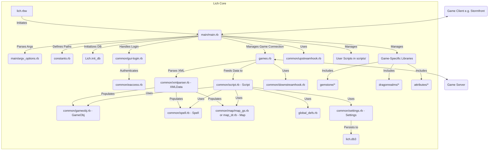

# Lich Scripting Engine & Game Libraries Documentation

## Table of Contents

1.  [High-Level Overview & Script Purpose](#1-high-level-overview--script-purpose)
2.  [Code Flow & Key Components](#2-code-flow--key-components)
3.  [Game Interaction & Automation](#3-game-interaction--automation)
4.  [Message Handling & Transformation](#4-message-handling--transformation)
5.  [Data Storage & Persistence](#5-data-storage--persistence)
6.  [Configuration](#6-configuration)
7.  [Lich Commands & User Interface](#7-lich-commands--user-interface)
8.  [Session State & System Event Handling](#8-session-state--system-event-handling)
9.  [Event Handling & Recurring Tasks](#9-event-handling--recurring-tasks)
10. [Threading, Async, and Background Tasks](#10-threading-async-and-background-tasks)
11. [Hooks, Monkey Patching, and Extension Points](#11-hooks-monkey-patching-and-extension-points)
12. [External Dependencies & Integrations](#12-external-dependencies--integrations)
13. [Key Game System Interactions](#13-key-game-system-interactions)
14. [Error Handling & Logging](#14-error-handling--logging)
15. [Security Considerations](#15-security-considerations)
16. [Other Important Logic](#16-other-important-logic)
17. [Setup and Installation](#17-setup-and-installation)
18. [Testing, Observability, and Maintenance](#18-testing-observability-and-maintenance)
19. [Assumptions and Areas for Clarification](#19-assumptions-and-areas-for-clarification)
20. [Migration & Re-Implementation Notes](#20-migration--re-implementation-notes)

---

## 1. High-Level Overview & Script Purpose

This codebase represents the core of **Lich**, a scripting engine and client enhancement tool primarily designed for text-based MUDs (Multi-User Dungeons) from Simutronics, specifically **Gemstone IV (GS)** and **DragonRealms (DR)**.

**Core Purpose:**
Lich acts as an intermediary between the game client (like Stormfront, Wizard Front End, or Genie) and the game server. It allows users to:
*   Automate repetitive game tasks.
*   Enhance the game interface with custom information and triggers.
*   Parse game data to maintain a structured understanding of the character's state and environment.
*   Provide a Ruby scripting environment for users to write their own custom scripts.

**Main Mode of Operation:**
*   **Lich Core (`lich.rbw`, `main/main.rb`, `games.rb`):** Acts as a proxy server. It intercepts network traffic, processes game data (often XML), and manages the execution of user scripts. It provides a foundational API for scripts to interact with the game.
*   **Utility Libraries (`common/`, `gemstone/`, `dragonrealms/`, `attributes/`):** These are collections of modules and classes that provide structured ways to access game state (e.g., character stats, skills, active spells, inventory, room information), perform common game actions (e.g., movement, combat maneuvers), and manage game-specific mechanics (e.g., Gemstone PSMs, DragonRealms Arcana). These are typically called by user scripts.
*   **User Scripts (not provided in this codebase, but reside in `scripts/`):** These are the `.lic` or `.rb` files written by users to automate tasks or add features. They leverage the Lich core and utility libraries.

**Initiation/Usage:**
*   Lich is typically started as an executable (`lich.rbw` or `ruby lich.rbw`).
*   It can be launched via command-line arguments, SAL (Simutronics Autolauncher) files, or a GTK-based graphical login interface.
*   User scripts are usually initiated via Lich commands (e.g., `;scriptname <args>`) or automatically at login via an `autostart.lic` script.

**Key Entry Points:**
*   `lich.rbw`: The main executable entry point.
*   `main/main.rb`: Contains the primary logic for setting up the Lich environment, handling client/server connections, and managing the main script execution loop.
*   `games.rb`: Manages the core game communication loop, XML parsing, and dispatches data to scripts and hooks.

## 2. Code Flow & Key Components

**Primary Execution Flow (Lich Core):**
1.  **Initialization (`init.rb`, `constants.rb`, `argv_options.rb`):**
    *   Parse command-line arguments to set up paths, game connection details, or special modes.
    *   Define directory constants and load essential libraries.
    *   Check for dependencies (Ruby version, SQLite3, GTK3).
2.  **Frontend/Connection Setup (`main/main.rb`):**
    *   If no direct connection info is provided, launch the GTK login GUI (`gui-login.rb`) or use SAL file data.
    *   The GUI allows users to select saved characters or enter new credentials.
    *   `EAccess.auth` (in `common/eaccess.rb`) handles authentication with Simutronics servers to get game launch keys.
    *   Lich starts a `TCPServer` to listen for the game client (e.g., Stormfront).
    *   The game client is launched (either via Simutronics launcher or a custom command), configured to connect to Lich's local server.
    *   Lich then establishes a connection to the actual game server (`Game.open` in `games.rb`).
3.  **Main Communication Loop (`games.rb`, `main/main.rb`):**
    *   `Game.thread` (in `games.rb`): Reads data from the game server socket.
        *   Cleans and processes the server string (game-specific logic via `GameInstance`).
        *   Parses XML data using `XMLData` (an instance of `XMLParser`).
        *   Strips XML to get plain text.
        *   Feeds raw XML and stripped text to `Script.new_downstream_xml` and `Script.new_downstream` respectively.
        *   Runs `DownstreamHook`s.
        *   Sends the (potentially modified) string to the game client (`$_CLIENT_`).
    *   `client_thread` (in `main/main.rb`): Reads data from the game client socket (`$_CLIENT_`).
        *   Runs `UpstreamHook`s.
        *   Handles Lich commands (prefixed with `#{$clean_lich_char}`).
        *   Forwards other client input to the game server (`Game._puts`).
4.  **Script Management (`common/script.rb`):**
    *   Lich commands like `;scriptname` call `Script.start`.
    *   Each script runs in its own thread(s) within a `ThreadGroup`.
    *   Scripts interact with Lich via global methods (`global_defs.rb`) and core Lich objects (`XMLData`, `GameObj`, `Spell`, `Map`, `Settings`, etc.).
5.  **Shutdown:**
    *   When the game client or server connection closes, or on exit command:
        *   Running scripts are killed.
        *   `at_exit` procs for scripts are run.
        *   Settings and variables are saved (`Settings.save`, `Vars.save`).
        *   Connections are closed.
        *   The GTK main loop is quit if active.

**Key Components & Architecture:**

**Major Modules/Classes:**

*   **`Lich` (Module, `lich.rb`):** Top-level namespace. Holds global settings, utility methods (logging, msgbox, frontend interaction), and DB access.
*   **`Lich::Common::Script` (`common/script.rb`):** Represents a running script. Manages its state, variables, labels, threads, and I/O buffers. Subclasses `ExecScript` and `WizardScript` handle specific script types.
*   **`Lich::Common::XMLParser` (`common/xmlparser.rb`, instance `XMLData`):** Parses XML data from the game server, populating vital game state variables (character stats, room info, active spells, etc.).
*   **`Lich::Common::GameObj` (`common/gameobj.rb`):** Represents items, NPCs, and PCs in the game world (room or inventory). Populated by `XMLParser`.
*   **`Lich::Common::Spell` (`common/spell.rb`):** Represents individual spells, their properties, status (active, known), and provides methods for casting. Data loaded from `spell-list.xml`.
*   **`Lich::Common::Map` (`common/map/map_gs.rb`, `common/map/map_dr.rb`):** Manages room data, exits, and pathfinding. Data loaded from map database files.
*   **`Lich::GameBase::Game` (`games.rb`):** Handles the low-level network communication with the game server and client. Manages the main data processing loop. Subclassed by game-specific implementations.
*   **`Lich::Common::Settings` (`common/settings.rb`):** Manages persistent script settings stored in SQLite. Provides scoped settings (global, game, character, script).
    *   `Lich::Common::GameSettings` and `Lich::Common::CharSettings`: Facades for game-scoped and character-scoped settings.
*   **`Lich::Common::Vars` (`common/vars.rb`) / `Lich::Common::UserVars` (`common/uservars.rb`):** Manages character-specific variables persisted in SQLite.
*   **`Lich::Common::UpstreamHook` & `Lich::Common::DownstreamHook`:** Allow scripts to intercept and modify client commands or server responses.
*   **`Lich::Util` (`util/util.rb`):** General utility functions.
*   **`Lich::Messaging` (`messaging.rb`):** Utility for formatting and sending messages to the client with frontend-specific considerations.
*   **Game-Specific Libraries:**
    *   `gemstone/`: Modules for Gemstone-specific mechanics (PSMs, Infomon, Group, Experience, etc.).
    *   `dragonrealms/`: Modules for DragonRealms-specific mechanics (DRInfomon and its sub-modules, DR common utilities).
    *   `attributes/`: Modules for character attributes like stats, skills, society info, often populated by Infomon/DRInfomon.

**Interaction:**
*   The core loop in `games.rb` receives server data.
*   `XMLParser` (`XMLData`) processes this data.
*   `GameObj`, `Spell`, `Map`, `Infomon`, etc., are updated based on parsed data.
*   Scripts read from these state objects and their own buffers (`get`, `waitfor`, `match`).
*   Scripts send commands to the game via `put` or `fput`, which go through `Game.puts`.
*   Hooks can modify data at both upstream and downstream points.

**C# Modularization Notes:**
*   `games.rb` (connection management, core loop) -> NetworkService, GameDataProcessorService.
*   `xmlparser.rb` (`XMLData`) -> GameStateService (holding strongly-typed state objects).
*   `script.rb` -> ScriptRunnerService, individual ScriptContext objects.
*   `settings.rb`, `vars.rb` -> ConfigurationService, UserSettingsService (persisted).
*   `map_*.rb` -> MappingService.
*   `gameobj.rb` -> GameObjectRepository/Service.
*   `spell.rb` -> SpellService.
*   Hooks -> EventAggregator or MediatR-like pattern.
*   Game-specific libraries -> Separate assemblies or namespaces (e.g., `Lich.Gemstone.dll`, `Lich.DragonRealms.dll`).

## 3. Game Interaction & Automation

**Interaction with Game Client:**
*   **Sending Commands:**
    *   `put "command"`: Sends a command to the game server (via `Game.puts`).
    *   `fput "command"`: Clears the script's input buffer, then sends a command and waits for specific success/failure/timeout conditions (defined in `global_defs.rb`, implemented in `dothis` and `dothistimeout`).
    *   `Game._puts "raw_command"`: Sends a raw command directly to the server socket (used internally or for low-level interaction).
*   **Matching Game Text:**
    *   `waitfor "pattern1", "pattern2", ...`: Pauses script execution until one of the provided string patterns is received from the game.
    *   `waitforre /regex/`: Similar to `waitfor`, but uses a Ruby `Regexp` object.
    *   `matchlabel "pattern", :label`: Pauses script execution until "pattern" is received, then `goto :label`.
    *   `matchwait "pattern1", "pattern2", ...`: Pauses script execution. If a pattern is received, `goto` the corresponding label set by previous `match` calls.
    *   `XMLData`: Scripts frequently access `XMLData` attributes (e.g., `XMLData.room_title`, `XMLData.health`) which are updated by Lich's internal XML parser.
    *   `GameObj`: Scripts query `GameObj.pcs`, `GameObj.npcs`, `GameObj.loot`, `GameObj.inv` to get lists of entities/items in the room or inventory.
*   **Lich Client Variables/Functions:**
    *   Global variables like `$_CLIENT_`, `$_SERVER_` represent client/server sockets.
    *   `$frontend` indicates the connected game client (Stormfront, Wizard, etc.).
    *   Various `check*` functions in `global_defs.rb` (e.g., `checkmana`, `checkstunned`) provide easy access to `XMLData` state.

**Key Game Commands Sent:**
*   Movement commands (e.g., `north`, `east`, `climb rope`).
*   Combat commands (e.g., `attack`, `cast`, `incant`).
*   Information commands (e.g., `info`, `skill`, `spell`, `exp`, `inventory`, `health`, `glance`, `look`).
*   Specific game system commands (e.g., `psm` commands for Gemstone, `arcana` commands for DragonRealms).
*   `_injury <mode>`: To set XML output mode for wounds/scars (GS).
*   `_flag Display Dialog Boxes 0`: To disable Stormfront dialog boxes (GS).

**Important Game Text Patterns Reacted To:**
*   **`XMLParser` (`common/xmlparser.rb`):** Handles a vast array of XML tags like `<roundTime>`, `<indicator>`, `<spell>`, `<prompt>`, `<streamWindow>`, `<compDef>`, `<inv>`, etc., to update `XMLData`.
*   **`Infomon::Parser` (`gemstone/infomon/parser.rb`):** Parses output from `INFO`, `EXP`, `SKILL`, `SPELL`, `PSM LIST ALL` commands using numerous regexes defined in `Pattern` to populate `Infomon`'s database. Also handles status messages (sleep, bind, silence, etc.).
*   **`DRParser` (`dragonrealms/drinfomon/drparser.rb`):** Parses output from DR commands like `EXP`, `INFO`, `SPELLS`, `ABILITY` using regexes in its `Pattern` module to update `DRStats`, `DRSkill`, `DRSpells`.
*   **`Group::Observer` (`gemstone/group.rb`):** Parses group join/leave/leader change messages.
*   **`CritRanks` (`gemstone/critranks/*.rb`):** Each critical table file defines regexes to match specific critical hit messages.
*   **`Bounty::Parser` (`gemstone/bounty/parser.rb`):** Uses `TASK_MATCHERS` regexes to parse bounty descriptions.
*   **`Script`'s `waitfor`, `match`, etc.:** User scripts define their own patterns to wait for.
*   **`dothis`, `dothistimeout` (`global_defs.rb`):** These internally use `waitforre` and handle common game responses like "Wait N seconds", "You are still stunned", "You must be standing".

**Automation Loops, Polling, State Machines:**
*   **Main Script Loop:** Most scripts operate in a loop, often controlled by `loop { ... }` or `while true { ... }`.
*   **State Machines:** Many scripts implement implicit or explicit state machines using variables and `goto` statements (in `.lic` scripts) or conditional logic to manage different phases of an action (e.g., hunting: find mob, attack, loot, skin, repeat).
*   **Polling:** Some scripts might poll game state (e.g., `checkmana`, `checkhealth`) periodically within their loops to make decisions. Lich itself doesn't have a central polling scheduler for scripts; scripts manage their own timing with `sleep` or by reacting to game text.
*   **Lich::queue (deprecated for direct use):** Was used for timed actions, now largely superseded by script-managed `sleep` or event-driven logic. `Gtk.queue` is for GUI thread safety. `ActiveSpell.queue` and `Infomon.queue` are internal.
*   **`watchfor` (`common/watchfor.rb`):** Creates background triggers that fire when specific patterns appear, often used for reactive actions (e.g., auto-stand on "knocked down", auto-drink potion on "low health"). These run in new threads.

## 4. Message Handling & Transformation

**Incoming Message Modification/Normalization:**
*   **`games.rb` (`Lich::GameBase::Game` and game-specific `GameInstance`s):**
    *   **XML Cleaning (`Lich::GameBase::XMLCleaner`):**
        *   `clean_nested_quotes`: Fixes malformed XML with nested single or double quotes within attribute values by replacing inner quotes with `&apos;` or `&quot;`. Rationale: Prevents REXML parsing errors.
        *   `fix_invalid_characters`: Replaces standalone `&` with `&amp;`, removes bell characters (`\a`), and converts `\x92` to `'`. Rationale: Ensures XML validity and handles common encoding issues.
        *   `fix_xml_tags`: Attempts to close unclosed `dynaStream` or `component` tags and removes some extraneous closing tags. Rationale: Handles specific known Simu XML oddities.
    *   **Game-Specific Cleaning:**
        *   `Gemstone::GameInstance#clean_serverstring`: Fixes a specific Rift/Scatter issue by transforming `<compDef id='room text'></compDef>` into a `<compDef id='room desc'>`.
        *   `DragonRealms::GameInstance#clean_serverstring`: Removes superfluous `<pushStream id="combat" /><popStream id="combat" />` sequences and fixes `<pushStream id="combat" /><component id=` to `<component id=`.
*   **`strip_xml` (in `global_defs.rb`, called by `games.rb`):**
    *   Removes all XML tags (`<[^>]+>`) from a copy of the server string to provide plain text to scripts that don't want XML.
    *   Decodes XML entities like `&gt;`, `&lt;`, `&amp;`.
    *   Specifically removes certain stream blocks like `spellfront`, `inv`, `bounty`, `society` and common component definitions (`compDef`, `inv`, `component`, `right`, `left`, `spell`, `prompt`) to declutter the text stream for non-XML-aware scripts.
    *   Handles multi-line XML structures by buffering incomplete streams.
*   **`sf_to_wiz` (in `global_defs.rb`, called by `games.rb` for Wizard/Avalon frontends):**
    *   Converts Stormfront-style XML tags to older GSL (Game Scripting Language) codes that the Wizard FE understands.
    *   Examples: `<pushBold/>` to `\034GSL\r\n`, `<popBold/>` to `\034GSM\r\n`.
    *   Transforms stream data for `familiar`, `death`, `roomName`, `roomDesc` into GSL equivalents.
    *   Handles `<LaunchURL>` tags.
    *   Strips out many other XML tags not understood by Wizard FE.
    *   Manages multi-line XML structures.
*   **`fb_to_sf` (in `global_defs.rb`, for Frostbite frontend):**
    *   Primarily removes `<c>` command prefix tags. A very minimal transformation.

**Outgoing Message Modification:**
*   **`Game.puts` (in `games.rb`):**
    *   Prepends `#{$cmd_prefix}` (usually `<c>`) to commands sent by scripts.
*   **`do_client` (in `global_defs.rb`):**
    *   If `$frontend` is Wizard or Avalon and the client sends `#{$cmd_prefix}\egbbk\n` (a specific code for launching forums), it's transformed to `#{$cmd_prefix}bbs`.

**Rationale for Transformations:**
*   **XML Validity:** To allow REXML to parse the often-malformed XML sent by Simutronics servers.
*   **Frontend Compatibility:** To adapt modern Stormfront XML to older frontends like Wizard FE which expect GSL codes.
*   **Scripting Simplicity:** To provide a cleaner, plain-text version of game data for scripts that don't parse XML directly.
*   **Noise Reduction:** To remove verbose or irrelevant XML structures from the text stream seen by some scripts.

**Distinguishing Message Types:**
*   **XML Tags:** The presence and type of XML tags (`<streamWindow id="...">`, `<compDef id="...">`, `<spell>`) are the primary way Lich categorizes incoming data. `XMLParser` and game-specific parsers use these.
*   **`@current_stream` / `@active_ids` (in `XMLParser`):** These track the currently active XML stream and component IDs, providing context for text parsing.
*   **Regex Matching:** Scripts and internal parsers (like `Infomon::Parser`, `DRParser`) use extensive regexes on the stripped text to identify specific game messages, announcements, combat rounds, etc.
*   **No Central Routing based on Type:** Lich doesn't have a high-level system that says "this is chat, route to chat handlers". Instead, XMLParser populates generic data structures, and individual scripts or modules register for specific text patterns (`watchfor`) or poll the global state (`XMLData`, `Infomon`).

**Internal Routing/Filtering:**
*   **`DownstreamHook` / `UpstreamHook`:** Allow scripts to intercept and modify *all* downstream/upstream data. This is a global filter chain.
*   **`Script` Buffers:** Each script has its own `downstream_buffer`. `want_downstream`, `want_downstream_xml`, `want_script_output` flags control what goes into this buffer.
*   **`XMLData` as a Global State:** Parsed XML updates `XMLData`, which many scripts read from. This is a form of indirect data routing.
*   **`Buffer` / `SharedBuffer`:** Provide more granular, potentially filtered views of game data for scripts that opt-in.

**C# Modularization Opportunities:**
*   **Message Normalization/Cleaning Service:** A dedicated service to handle initial XML cleaning and frontend-specific transformations.
*   **XML Parsing Service:** A service to parse valid XML into strongly-typed C# objects (instead of `XMLData`'s dynamic hash/array structure).
*   **Text Parsing Engine:** A system where modules can register regexes and handlers, similar to `watchfor` but potentially more structured (e.g., using attributes or a fluent API for registration). This engine would process the stripped text.
*   **Event Aggregator:** For broadcasting specific game events (e.g., `RoomChangedEvent`, `SpellCastEvent`) derived from parsed data, allowing services to subscribe to what they need.

## 5. Data Storage & Persistence

Lich employs several mechanisms for storing and persisting data:

1.  **In-Memory (Runtime) Data:**
    *   **`XMLData` (`common/xmlparser.rb`):** A central, in-memory object instance of `XMLParser`. It's the primary live state repository, constantly updated by parsing incoming XML from the game. Stores:
        *   Character stats (`mana`, `health`, `spirit`, `stamina`, `stance_value`, `mind_value`, `encumbrance_value`, `level`, `name`, `player_id`, `game`).
        *   Active spell information (from `<spell>` tags and `dialogData` for PSM3).
        *   Roundtime (`roundtime_end`, `cast_roundtime_end`).
        *   Room information (`room_title`, `room_description`, `room_exits`, `room_id`).
        *   Indicator states (e.g., `IconPOISONED`, `IconSTUNNED`).
        *   Wound and scar data (`injuries`).
        *   Current target IDs (`current_target_ids`, `current_target_id`).
        *   Dialog data from PSM3 (`dialogs` hash, storing buffs, active spells, debuffs, cooldowns with expiry times).
        *   DR-specific active spell list (`dr_active_spells`).
    *   **`GameObj` (`common/gameobj.rb`):** Static class arrays store lists of game objects currently perceived:
        *   `@@loot`, `@@npcs`, `@@pcs`: Objects in the current room.
        *   `@@inv`: Items in the character's direct inventory (not in containers).
        *   `@@contents`: A hash storing items within containers (key is container ID).
        *   `@@right_hand`, `@@left_hand`: Objects held.
        *   `@@room_desc`: Objects mentioned in the room description.
        *   `@@fam_*`: Similar lists for familiar's view.
        *   Status hashes (`@@npc_status`, `@@pc_status`).
    *   **`Spell` (`common/spell.rb`):** `@@list` stores all known spell definitions loaded from `effect-list.xml`. Individual `Spell` instances track `@active` status and `@timeleft`.
    *   **`Map` (`common/map/map_gs.rb`, `common/map/map_dr.rb`):** `@@list` stores all room objects loaded from map database files. `@@current_room_id` tracks the current room.
    *   **`Script` (`common/script.rb`):** Each running script instance holds its own state:
        *   `@vars`: Script arguments.
        *   `@watchfor`: Registered regexes and procs.
        *   Buffers (`downstream_buffer`, `upstream_buffer`, `unique_buffer`).
    *   **`Infomon` (`gemstone/infomon.rb`) & DR Equivalent (`dragonrealms/drinfomon/`):**
        *   `Infomon::Cache`: An in-memory hash (`@records`) caching data read from `infomon.db` for performance.
        *   DR modules (`DRStats`, `DRSkill`, `DRRoom`, `DRSpells`): Use class variables (`@@variable_name`) to store current character/game state parsed from text.
    *   **`SessionVars` (`sessionvars.rb`):** `@@svars` hash for temporary, session-only script intercommunication.
    *   **`Group`, `Experience`, `Gift`, `ReadyList`, `StowList` (Gemstone):** Use class variables for their respective states.

2.  **Lich Variables (Persisted in `lich.db3` by `Vars` module):**
    *   **`Vars` (`common/vars.rb`) / `UserVars` (`common/uservars.rb`):**
        *   Stores character-specific key-value pairs. Scripts use `Vars['my_setting'] = value`.
        *   Persisted in the `uservars` table in `lich.db3`. The `hash` column stores a Marshal-ed dump of the `@@vars` hash for the current character (scoped by `game:character_name`).
        *   A background thread periodically saves changes.

3.  **Script Settings (Persisted in `lich.db3` by `Settings` module):**
    *   **`Settings` (`common/settings.rb`):**
        *   Stores script-specific settings. Scripts use `Settings['my_script_setting'] = value`.
        *   Persisted in the `script_auto_settings` table in `lich.db3`. Settings are scoped by script name and a further "scope" string (defaulting to global ":", but also used for `GameSettings` and `CharSettings`). The `hash` column stores a Marshal-ed dump of the settings hash for that script/scope.
        *   `SettingsProxy` allows for direct manipulation of nested hashes/arrays (e.g., `Settings['my_hash']['key'] = value`) with changes automatically saved.
    *   **`GameSettings` (`common/settings/gamesettings.rb`):** Facade over `Settings` that scopes by game (e.g., `GSIV`, `DR`).
    *   **`CharSettings` (`common/settings/charsettings.rb`):** Facade over `Settings` that scopes by `game:character_name`.

4.  **Lich Global Settings (Persisted in `lich.db3`):**
    *   Stored in the `lich_settings` table in `lich.db3`.
    *   Examples: `win32_launch_method`, `did_trusted_defaults`, GUI display preferences (`display_lichid`, `track_dark_mode`, etc.), `core_updated_with_lich_version`.

5.  **Configuration Files (Static Data):**
    *   **`effect-list.xml` (Data for `Spell` class):** Located in `DATA_DIR/[gamename]/`. Contains definitions for spells (name, number, type, messages, costs, durations). Loaded by `Spell.load`.
    *   **Map Databases (`map-*.dat`, `map-*.xml`, `map-*.json`):** Located in `DATA_DIR/[gamename]/`. Contains room data. Loaded by `Map.load`.
    *   **`gameobj-data.xml` (Data for `GameObj` item typing):** Located in `DATA_DIR/`. Defines regexes to categorize items by type (e.g., weapon, armor, food) and sellability. Loaded by `GameObj.load_data`. Custom overrides in `DATA_DIR/gameobj-custom/gameobj-data.xml`.
    *   **Critical Hit Tables (`gemstone/critranks/*_critical_table.rb`):** These Ruby files define hashes mapping critical hit messages to their mechanical effects. Loaded by `CritRanks.init`.

6.  **Specialized Data Files:**
    *   **`entry.dat` (`DATA_DIR/`):** Stores saved login credentials and settings for the GTK login GUI. Data is a Marshal-ed array of hashes, packed with `m`.
    *   **`simu.pem` (`DATA_DIR/`):** SSL certificate for EAccess connections.
    *   **Script-specific data files:** Scripts can create their own files in `DATA_DIR/[script_name]/` using `Script.open_file`.
    *   **Log files:** Scripts can log to `LOG_DIR/[script_name].log` using `Script.log`. Debug logs are in `TEMP_DIR/debug-*.log`.

**Structured Data:**
*   **`GameObj`:** `@id`, `@noun`, `@name`, `@before_name`, `@after_name`. Also infers `type` and `sellable` status.
*   **`Spell`:** `@num`, `@name`, `@type`, `@msgup`, `@msgdn`, `@circle`, `@active`, `@cost` (hash), `@duration` (hash), etc.
*   **`Map`/`Room`:** `@id`, `@title` (array), `@description` (array), `@paths` (array), `@uid` (array), `@location`, `@wayto` (hash), `@timeto` (hash), `@tags` (array).
*   **`Infomon` / `DRStats` / `DRSkill`:** Store attributes as key-value pairs, often with nested structures for stats (value, bonus, enhanced_value, enhanced_bonus) or skills (rank, percent, rate).
*   **`Bounty::Task`:** `@description`, `@type`, `@requirements` (hash), `@town`.

**Caching:**
*   **`Infomon::Cache`:** In-memory hash caching database lookups for `infomon.db`.
*   **`Settings.@settings_cache`:** In-memory hash caching database lookups for script settings from `lich.db3`.
*   **`Vars.@@vars`:** Acts as an in-memory cache for user variables, periodically saved.
*   `Spell.@@list`, `Map.@@list`, `GameObj.@@type_data`, etc., are all in-memory caches of data loaded from files.

**C# Modularization for Data/Persistence:**
*   **Services for Data Access:**
    *   `IGameStateService` (for `XMLData` equivalent).
    *   `ICharacterSettingsService`, `IGameSettingsService`, `IScriptSettingsService` (for `CharSettings`, `GameSettings`, `Settings` equivalents, potentially using EF Core or Dapper with SQLite).
    *   `IMapService`, `ISpellService`, `IGameObjectService` (for loading and querying static/dynamic game data).
*   **Configuration Files:** Use `.json` or `.xml` for static data like spell definitions, item types, critical tables, and load them into strongly-typed C# collections/objects on startup.
*   **Caching:** Utilize `IMemoryCache` or other .NET caching mechanisms.
*   **Serialization:** Use `System.Text.Json` or `Newtonsoft.Json` for `entry.dat`-like data or for persisting complex settings if not using a relational approach for everything.

## 6. Configuration

Lich and its scripts are configured through several means:

1.  **Command-Line Arguments:**
    *   Processed by `main/argv_options.rb` and the initial block in `lich.rbw`.
    *   **Key Arguments:**
        *   `--home=PATH`: Sets `LICH_DIR` (main Lich program directory).
        *   `--temp=PATH`: Sets `TEMP_DIR`.
        *   `--scripts=PATH`: Sets `SCRIPT_DIR`.
        *   `--maps=PATH`: Sets `MAP_DIR`.
        *   `--logs=PATH`: Sets `LOG_DIR`.
        *   `--backup=PATH`: Sets `BACKUP_DIR`.
        *   `--data=PATH`: Sets `DATA_DIR`.
        *   `--lib=PATH`: Sets `LIB_DIR`.
        *   `--login CHARACTER_NAME`: Directly logs in a character (used with other game/account flags).
        *   `--gemstone`, `--dragonrealms`, `--platinum`, `--shattered`, `--test`, `--fallen`, `--gst`, `--drt`: Specify game server.
        *   `--wizard`, `--stormfront`, `--avalon`, `--frostbite`, `--genie`: Specify frontend type.
        *   `--without-frontend`: Runs Lich without launching a game client, connecting directly.
        *   `--sal SAL_FILE_PATH`: Launches Lich using a `.sal` file.
        *   `--game=HOST:PORT`: Manually specifies game server IP and port.
        *   `--start-scripts=script1,script2`: Automatically starts specified scripts after login.
        *   `--dark-mode=true|false`: Enables/disables dark mode for GTK GUI.
        *   `--detachable-client=HOST:PORT` or `PORT`: Allows a secondary client (like Profanity) to connect.
    *   **Effect:** These primarily set up paths, initial connection parameters, and auto-start behaviors.

2.  **`constants.rb`:**
    *   Defines default directory paths (`LICH_DIR`, `TEMP_DIR`, `DATA_DIR`, `SCRIPT_DIR`, `LIB_DIR`, `MAP_DIR`, `LOG_DIR`, `BACKUP_DIR`) if not overridden by command-line arguments.
    *   Contains static mappings like `DIRMAP`, `SHORTDIR`, `LONGDIR`, `MINDMAP`, `ICONMAP` used for internal game state representation and command conversion. These are not typically user-modified.

3.  **`lich.db3` (SQLite Database - `DATA_DIR/lich.db3`):**
    *   **`lich_settings` table:** Stores global Lich settings.
        *   `win32_launch_method`: (Windows) Stores preferred SGE/SAL launch method.
        *   `did_trusted_defaults`: Flag indicating if default trusted scripts were set.
        *   `display_lichid`, `display_uid`, `display_exits`, `display_stringprocs`, `hide_uid_flag`: GUI display preferences.
        *   `track_autosort_state`, `track_dark_mode`, `track_layout_state`: GUI state preferences.
        *   `core_updated_with_lich_version`: Tracks the Lich version for which core scripts were last updated.
        *   `debug_messaging`: Toggles verbose messaging for debugging.
        *   `log_enabled`, `log_filter`: For `Lich::Log` feature.
    *   **`uservars` table (Managed by `Vars`/`UserVars`):**
        *   Stores character-specific variables set by users or scripts (e.g., `UserVars.lootsack = "backpack"`).
        *   Scoped by `game:character_name`. Values are Marshal-ed.
    *   **`script_auto_settings` table (Managed by `Settings`):**
        *   Stores script-specific settings, potentially scoped globally, per-game, or per-character.
        *   Example: `Settings['myscript_setting'] = value`, `CharSettings['some_char_pref'] = value`, `GameSettings['some_game_pref'] = value`.
        *   Values are Marshal-ed.
    *   **`trusted_scripts` table (Ruby 2.x only):** Lists scripts explicitly trusted by the user to bypass certain security restrictions.
    *   **`simu_game_entry` table:** Used by `EAccess` to cache game entry data (likely character codes, game codes).
    *   **`enable_inventory_boxes` table:** Tracks per-player preference for Stormfront inventory boxes.

4.  **`entry.dat` (`DATA_DIR/entry.dat`):**
    *   Stores saved login profiles for the GTK GUI (account ID, encrypted password placeholder, character name, game code, frontend choice, custom launch commands).
    *   Data is a Marshal-ed array of hashes, packed using `m`.

5.  **In-Script Constants/Variables:**
    *   Some scripts (not shown in this core codebase, but a common pattern) might have constants at the top of their files that users might modify (e.g., a list of items to hunt for, a specific room ID to go to).
    *   User-configurable variables are typically managed via `UserVars` or `Settings` for persistence.

**Effect of Key Configuration Options:**
*   Directory paths determine where Lich finds its components, saves data, and looks for scripts.
*   Game/frontend settings dictate how Lich connects and communicates.
*   `UserVars` and `Settings` allow scripts to be highly customizable per character or game.
*   GUI display settings (`display_lichid`, etc.) alter the information Lich presents in the game client.
*   `track_dark_mode` controls the GTK theme.

**C#/.NET Configuration Patterns:**
*   **`appsettings.json`:** For global Lich configurations (default paths, EAccess URLs, etc.).
*   **User-specific config files (e.g., in `AppData`):** For settings like `entry.dat` or GUI preferences.
*   **Dependency Injection (`IOptions<T>`):** For providing typed configuration objects to services.
*   **EF Core or other ORM with SQLite:** For `lich.db3` data (user variables, script settings). A dedicated `DbContext` would manage these tables with strongly-typed entities.
*   **Per-script configuration:** Scripts (if implemented as plugins or separate executables) could have their own `.json` config files.

## 7. Lich Commands & User Interface

**Lich Commands (Typed by User in Game Client):**
Lich commands are prefixed by `#{$clean_lich_char}` (typically `;` or `,`). They are processed by `do_client` in `global_defs.rb`.

*   **Script Management:**
    *   `#{$clean_lich_char}<script_name> [args...]`: Starts a script.
        *   Example: `;autostart add mymacro`
    *   `#{$clean_lich_char}force <script_name> [args...]`: Starts a script even if it's already running.
        *   Example: `;force lnet`
    *   `#{$clean_lich_char}k` or `#{$clean_lich_char}kill` or `#{$clean_lich_char}stop`: Kills the most recently started script.
    *   `#{$clean_lich_char}k <script_name>` or `#{$clean_lich_char}kill <script_name>` or `#{$clean_lich_char}stop <script_name>`: Kills a specific script by name (partial name matching).
    *   `#{$clean_lich_char}ka` or `#{$clean_lich_char}killall` or `#{$clean_lich_char}stopall`: Kills all running scripts (respects `no_kill_all` flag).
    *   `#{$clean_lich_char}p` or `#{$clean_lich_char}pause`: Pauses the most recently started, unpaused script.
    *   `#{$clean_lich_char}p <script_name>` or `#{$clean_lich_char}pause <script_name>`: Pauses a specific script.
    *   `#{$clean_lich_char}pa` or `#{$clean_lich_char}pauseall`: Pauses all unpaused scripts (respects `no_pause_all` flag).
    *   `#{$clean_lich_char}u` or `#{$clean_lich_char}unpause`: Unpauses the most recently started, paused script.
    *   `#{$clean_lich_char}u <script_name>` or `#{$clean_lich_char}unpause <script_name>`: Unpauses a specific script.
    *   `#{$clean_lich_char}ua` or `#{$clean_lich_char}unpauseall`: Unpauses all paused scripts (respects `no_pause_all` flag).
    *   `#{$clean_lich_char}l` or `#{$clean_lich_char}list`: Lists currently running, non-hidden scripts.
    *   `#{$clean_lich_char}la` or `#{$clean_lich_char}listall`: Lists all running scripts, including hidden ones.
*   **Execution & Debugging:**
    *   `#{$clean_lich_char}e <code>` or `#{$clean_lich_char}exec <code>`: Executes arbitrary Ruby code as a temporary script.
        *   Example: `;e GameObj.inv.each { |i| respond i.name }`
    *   `#{$clean_lich_char}eq <code>` or `#{$clean_lich_char}execq <code>`: Same as `exec`, but quieter (no start/exit messages).
    *   `#{$clean_lich_char}en <name> <code>` or `#{$clean_lich_char}execname <name> <code>`: Executes code as a named temporary script.
    *   `#{$clean_lich_char}send <line>`: Sends a line of text to all running scripts as if it came from the game.
    *   `#{$clean_lich_char}send to <script_name> <line>`: Sends a line to a specific script.
*   **Security (Ruby 2.x only):**
    *   `#{$clean_lich_char}trust <script_name>`: Marks a script as trusted, allowing it potentially unsafe operations.
    *   `#{$clean_lich_char}distrust <script_name>` or `#{$clean_lich_char}untrust <script_name>`: Removes a script from the trusted list.
    *   `#{$clean_lich_char}lt` or `#{$clean_lich_char}listtrusted`: Lists trusted scripts.
*   **Lich Settings & Maintenance:**
    *   `#{$clean_lich_char}set <variable> on|off`: Toggles global Lich boolean settings stored in `lich_settings` table.
    *   `#{$clean_lich_char}lich5-update --<subcommand>` (or `#{$clean_lich_char}l5u`): Manages Lich updates (see `update.rb` for subcommands like `--announce`, `--update`, `--revert`).
        *   Example: `;l5u --update`
    *   `#{$clean_lich_char}hmr <regex_filepath_pattern>`: Hot Module Reload; reloads Ruby files matching the pattern.
        *   Example: `;hmr infomon.rb`
*   **Information Display Toggles:**
    *   `#{$clean_lich_char}display lichid [true|false]`: Toggles display of Lich map IDs.
    *   `#{$clean_lich_char}display uid [true|false]`: Toggles display of game UIDs (RealID).
    *   `#{$clean_lich_char}display flaguid [true|false]`: (DR Specific) Toggles if UID is hidden when game client "FLAG ShowRoomID ON" is active.
    *   `#{$clean_lich_char}display exits [true|false]`: Toggles display of non-StringProc/Obvious exits.
    *   `#{$clean_lich_char}display stringprocs [true|false]`: Toggles display of StringProc exits.
*   **Game-Specific Infomon Commands (GS):**
    *   `#{$clean_lich_char}infomon sync`: Refreshes character data.
    *   `#{$clean_lich_char}infomon reset` or `redo`: Resets and refreshes character data.
    *   `#{$clean_lich_char}infomon show [full]`: Displays stored Infomon data.
    *   `#{$clean_lich_char}infomon effects [true|false]`: Toggles display of spell effect durations.
*   **Gemstone-Specific `magic` Command (Alias for `magicinfo` script):**
    *   `#{$clean_lich_char}magic` or `#{$clean_lich_char}magic announce`: Shows active spells and durations.
    *   `#{$clean_lich_char}magic set <spell_num> <minutes>`: Manually sets a spell's duration.
    *   `#{$clean_lich_char}magic clear [spell_name_or_num]`: Clears one or all active spells from tracking.
    *   `#{$clean_lich_char}magic circles`: Toggles display of spell circle labels.
    *   `#{$clean_lich_char}magic bonuses`: Toggles display of spell bonuses.
    *   `#{$clean_lich_char}magic gift`: Toggles display of Gift of Lumnis info.
*   **Gemstone-Specific `sk` Command (Self-Knowledge spell management):**
    *   `#{$clean_lich_char}sk add <spell_num>`: Adds a spell to the SK known list.
    *   `#{$clean_lich_char}sk rm <spell_num>`: Removes a spell from the SK known list.
    *   `#{$clean_lich_char}sk list`: Lists SK known spells.
    *   `#{$clean_lich_char}sk help`: Shows help for the SK command.
*   **Help:**
    *   `#{$clean_lich_char}help`: Displays a list of built-in Lich commands.

**Other User Interactions:**
*   **GTK Login GUI (`common/gui-login.rb`):** Provides a graphical interface for selecting characters, frontends, and managing saved login profiles before connecting to the game.
*   **Game Aliases:** Scripts can define game aliases (e.g., via `fput "alias add x some_lich_command"`) that allow users to trigger Lich script functionality with shorter in-game commands.

**C# Modularization for Commands/UI:**
*   **Command Dispatcher Service:** A central service to parse Lich commands and route them to appropriate handlers or script execution services.
*   **GUI Layer:** If a GUI is developed for the C# version, it would be a separate project (e.g., WPF, Avalonia) interacting with core Lich services via APIs.
*   **Script Management API:** Expose methods for starting, stopping, pausing, and listing scripts through the command dispatcher or a dedicated management service.
*   **Settings Management API:** Allow querying and modification of Lich/script settings through commands.

## 8. Session State & System Event Handling

**Out-of-Band System Message Handling:**
*   Lich itself doesn't have a centralized system for explicitly identifying and categorizing all "out-of-band" system messages like idle warnings or server reboot announcements *beyond* what is parsed by `XMLParser` for general game state.
*   Individual scripts are responsible for detecting such messages using `waitfor`/`match`/`watchfor` and implementing their own responses.
*   **Disconnects:** The core `Game.thread` in `games.rb` detects when the socket to the game server is closed (e.g., `server_string` becomes `nil` or an exception is raised). This triggers a shutdown sequence:
    *   Kills running scripts.
    *   Calls `at_exit` procs for scripts.
    *   Saves settings.
    *   Closes connections.
    *   May attempt reconnection if configured.
*   **Idle Warnings/Forced Logouts:** No specific core handling. Scripts that perform long-running automation (e.g., hunting scripts) typically include their own logic to send periodic "anti-idle" commands or to detect and recover from forced logouts.
*   **Server Warnings (e.g., reboot countdowns):** Scripts must watch for these. A common pattern is for a dedicated script (like an "alert" script) to monitor for such messages and notify the user or other scripts.

**Automatic Recovery Mechanisms:**
*   **Reconnection (`reconnect_if_wanted` proc in `main/main.rb`):**
    *   Triggered after a disconnect if the `--reconnect` command-line flag was used.
    *   Waits for a configurable delay (`--reconnect-delay`).
    *   Re-executes Lich with the original command-line arguments, plus `--reconnected` to indicate it's a reconnect attempt.
    *   Can increment the delay for subsequent retries.
*   **Session Token Refresh:** Not explicitly handled by Lich core. EAccess authentication provides a session key that is used for the initial game connection. If this key expires or becomes invalid during a session, the game typically disconnects the client, which would trigger Lich's disconnect handling (and potential reconnection).
*   **State Restoration:**
    *   Lich core saves `Vars` and `Settings` on exit, which are reloaded when Lich starts. This preserves script configurations and character-specific data.
    *   `Infomon` and `DRInfomon` data is persisted in `lich.db3` (for GS) or relies on `UserVars`/`CharSettings` (for DR), allowing state to be reloaded.
    *   Runtime state within scripts (e.g., current task in a multi-step script) is generally lost unless the script explicitly saves it to `Vars` or `Settings` and reloads it on startup.
    *   The `autostart.lic` script is crucial for re-launching essential or desired scripts after login/reconnection.

**Server "Keep-Alive" / Anti-Idle Logic:**
*   Lich core does not implement general keep-alive or anti-idle commands. This is the responsibility of individual user scripts.
*   The `SynchronizedSocket` used for the game connection can have `SO_KEEPALIVE` enabled at the TCP level, but this is for maintaining the network connection, not for preventing game-level idling.

**Timeouts:**
*   **Client Connection Timeout (`main/main.rb`):** After starting the local server, Lich waits about 30 seconds (300 * 0.1s) for the game client to connect. If it doesn't, Lich exits or triggers a reconnect.
*   **Game Server Connection Timeout (`main/main.rb`):** After launching the client, Lich waits about 30 seconds for the connection to the actual game server (`Game.open`). If it fails, Lich exits or triggers a reconnect.
*   **Manual Connection Mode Timeout (`main/main.rb`):** If Lich is started with `-g HOST:PORT`, it waits about 120 seconds for a client to connect before timing out.
*   **Script Timeouts:** Methods like `dothistimeout` and `matchtimeout` allow scripts to set timeouts for waiting for specific game responses.

**Session Continuity & Connection State Transitions:**
*   Lich's main state is either "disconnected," "waiting for client," "waiting for game server," or "connected."
*   The transition from "disconnected" to "connected" involves the login GUI/SAL file processing, EAccess authentication, client launch, and finally, successful `Game.open`.
*   A disconnect transitions Lich back to a state where it might attempt reconnection or exit.
*   The `$_CLIENT_` and `$_SERVER_` (via `Game.socket`) global variables represent the active connections. Their state (e.g., `closed?`) is checked to manage transitions.

**C# Modularization Opportunities:**
*   **`ConnectionManagerService`:** Handle all aspects of establishing and maintaining game client and server connections, including EAccess authentication, SAL parsing, client launching, and socket management.
*   **`SessionRecoveryService`:** Implement reconnection logic, potentially with more sophisticated strategies (e.g., exponential backoff, checking server status pages).
*   **`SystemEventMonitorService`:** A service that specifically watches for critical system messages (reboot warnings, explicit disconnect messages from the server) and publishes events that other services (like `ScriptRunnerService` or `SessionRecoveryService`) can subscribe to.
*   **`AntiIdleService` (Optional):** If a generic anti-idle mechanism is desired, this service could send periodic, configurable keep-alive commands if no other game activity is detected.

## 9. Event Handling & Recurring Tasks

**Game Event Handling:**

*   **Primary Mechanism: Text Pattern Matching in Scripts:**
    *   **`waitfor`, `waitforre`, `match`, `matchre`, `matchfind`, `matchfindword`, `matchfindexact`, `matchoutput`, `matchboth`, `matchroom` (from `global_defs.rb`):** These are blocking calls. Scripts use them to pause execution and wait for specific lines or patterns to appear in their downstream buffer (text from the game or other scripts). This is the most common form of "event" handling.
    *   **`get?` combined with `if line =~ /pattern/`:** Non-blocking polling of the downstream buffer.
*   **`Watchfor` (`common/watchfor.rb`):**
    *   Allows scripts to register a `Regexp` and a `Proc` (callback).
    *   `Script.new_downstream` (called by `games.rb` for every line of stripped game text) iterates through the current script's `watchfor` hash.
    *   If a line matches a registered `Regexp`, the associated `Proc` is executed in a **new thread**. This provides asynchronous, pattern-based event handling.
*   **`XMLParser` (`XMLData`) Callbacks (Implicit):**
    *   The `XMLParser` itself acts as a large event handler for XML tags. Its `tag_start`, `text`, and `tag_end` methods are callbacks triggered by the REXML stream parser. These methods update the global `XMLData` state.
    *   Specific tag handling (e.g., for `<roundTime>`, `<indicator>`, `<spell>`) can be seen as specific event handlers that update corresponding `XMLData` attributes.
*   **`UpstreamHook` and `DownstreamHook`:**
    *   These are not strictly event handlers but intercept-and-modify pipelines. They are triggered for every line going to the server or coming from the server, respectively. Scripts can use them to react to or change data flow globally.
*   **Custom Event Systems within Scripts:** Some complex user scripts might implement their own mini event systems, often by having a central loop that dispatches based on matched text or changed state variables.

**Recurring Tasks:**

*   **Script-Managed Loops with `sleep`:** The most common way recurring tasks are implemented is within a script's main `loop` or `while` block, using `sleep` to control the frequency.
    *   Example: A hunting script might loop: `find_mob -> attack_mob -> loot_mob -> sleep 5 -> repeat`.
*   **`Lich::GameBase::Game.@wrap_thread` (`games.rb`):** This thread seems to perform a one-time check after a short delay (6 seconds or until autostart completes) to send a `look` command if `autostart.lic` hasn't run. This is more of an initialization task than a truly recurring one.
*   **`Infomon.queue` Processing Thread (`gemstone/infomon.rb`):** A background thread that pops SQL statements from a queue and executes them against the `infomon.db`. This makes database writes asynchronous.
*   **`ActiveSpell.watch!` Thread (`gemstone/infomon/activespell.rb`):** A background thread that waits for updates to `XMLData.active_spells` (signaled by `ActiveSpell.request_update` which pushes to a queue) and then processes spell duration changes.
*   **`Vars.@@save` Thread (`common/vars.rb`):** A background thread that periodically (every 300 seconds) saves the `@@vars` hash to the database if changes have occurred.
*   **GTK Idle Handler (`common/gtk.rb`):** `GLib::Idle.add` schedules a block to be run when GTK is idle. The current implementation just `sleep 0.01`, likely to yield control and keep the GUI responsive.
*   **No Central Lich Scheduler for Scripts:** Lich core does not provide a built-in cron-like scheduler for arbitrary script tasks. Scripts manage their own timing for recurring actions.

**C#/.NET Event/Task Equivalents:**
*   **Text Pattern Matching:** Can be replicated with regex matching in message processing loops.
*   **`Watchfor`:**
    *   Could be implemented with a list of `(Regex, Action)` tuples that are checked against each incoming message.
    *   Alternatively, an event aggregator pattern where specific events (e.g., `PlayerStatusChangedEvent`, `RoomDescriptionParsedEvent`) are published, and "watchers" subscribe to these typed events. This is more robust than raw text matching.
*   **`XMLParser` Callbacks:** C# XML parsing libraries (like `System.Xml.Linq` or `System.Xml.XmlReader`) offer similar event-driven or stream-based parsing models.
*   **Recurring Tasks:**
    *   `System.Threading.Timer` or `Task.Delay` within an `async` loop for simple periodic tasks.
    *   Background services (`IHostedService`) for long-running, independent tasks like the `Infomon.queue` processor or `Vars` saver.
    *   For tasks that need to run on a UI thread (if a GUI is present), mechanisms like `Dispatcher.Invoke` (WPF) or `SynchronizationContext.Post` would be used.
*   **Asynchronous Operations:** `async/await` should be used extensively for I/O-bound operations (network, file access) and for managing long-running script logic without blocking the main Lich processing threads.

## 10. Threading, Async, and Background Tasks

Lich makes extensive use of Ruby threads for concurrency and responsiveness.

**Ruby Threads:**

*   **Main Lich Thread (`lich.rbw`):**
    *   `@main_thread`: This is the primary thread of execution after initial setup. It typically handles either:
        *   The GTK main loop (`Gtk.main`) if a GUI is used.
        *   A blocking join on the `Game.thread` if running headlessly or if GTK setup fails.
*   **Game Connection and Processing Threads (`games.rb`, `main/main.rb`):**
    *   `Game.thread` (in `games.rb`): Dedicated to reading data from the game server socket. This is a critical, long-running thread.
    *   `client_thread` (in `main/main.rb`): Dedicated to reading data from the game client socket. Also a critical, long-running thread.
    *   `accept_thread` (in `main/main.rb`): Short-lived thread to accept the game client's connection to Lich's local server.
    *   `connect_thread` (in `main/main.rb`): Short-lived thread to establish the connection to the actual game server.
    *   `detachable_client_thread` (in `main/main.rb`): If enabled, a long-running thread that listens for and handles connections from secondary clients (like Profanity).
*   **Script Execution Threads (`common/script.rb`):**
    *   Each script started by `Script.start` (or its variants like `ExecScript.start`) runs in a **new Thread**.
    *   Scripts can also spawn their own additional threads using `Thread.new`.
    *   All threads created by a script are managed within its `@thread_group` (a `ThreadGroup` instance).
*   **`Watchfor` Callback Threads (`common/script.rb` via `global_defs.rb`):**
    *   When a `watchfor` pattern is matched, the associated Proc (callback) is executed in a **new Thread**.
*   **Background Utility Threads:**
    *   `Infomon.queue` processing thread (`gemstone/infomon.rb`): A single background thread processes a queue of SQL statements for asynchronous database writes.
    *   `ActiveSpell.watch!` thread (`gemstone/infomon/activespell.rb`): A background thread monitors a queue for signals to update active spell durations.
    *   `Vars.@@save` thread (`common/vars.rb`): A background thread periodically saves `UserVars` to the database.
    *   `Lich::GameBase::Game.@wrap_thread` (`games.rb`): A short-lived thread for an initial `look` command if autostart doesn't fire.
    *   GTK Timeout/Idle Handlers (`common/gtk.rb`): `GLib::Timeout.add` and `GLib::Idle.add` schedule blocks to be run by the GTK main loop, effectively on the main GUI thread.

**Asynchronous Code Constructs (Implicit):**
*   While Ruby doesn't have `async/await` like C#, the use of threads for I/O operations (socket reads/writes, script execution waiting for game responses) achieves a form of asynchronous behavior, preventing the main Lich process or GUI from freezing.
*   The `*_gets?` methods (e.g., `Buffer.gets?`, `Script.gets?`) provide non-blocking reads from buffers, allowing scripts to poll for data without halting.

**Shared Resource Management & Race Conditions:**
*   **`Mutex`:** Lich uses `Mutex` extensively for synchronizing access to shared resources:
    *   `Lich.db_mutex`: For all SQLite database operations via `Lich.db`.
    *   `Game.@mutex`: For writing to the game server socket (`@socket.puts`).
    *   `SynchronizedSocket.@mutex` (`common/class_exts/synchronizedsocket.rb`): For writes to the client socket (`$_CLIENT_` or `$_DETACHABLE_CLIENT_`).
    *   `Buffer.@@mutex` and `SharedBuffer.@buffer_mutex`: For accessing their internal array buffers.
    *   `Script.@killer_mutex`: To prevent race conditions during script killing.
    *   `Map.@@load_mutex`, `Map.@@current_room_mutex`, `Map.@@fuzzy_room_mutex`: For map loading and current room determination.
    *   `Spell.@@load_mutex`, `Spell.@@cast_lock` (Array used as a queue/lock).
    *   `Lich::Claim::Lock` (`Mutex`).
*   **Queues for Asynchronous Operations:**
    *   `Infomon.queue`: SQL statements are pushed onto this queue, and a single dedicated thread processes them, serializing DB writes.
    *   `ActiveSpell.queue`: Used to signal the `ActiveSpell` thread that spell data might have changed.
*   **Potential Issues:** While `Mutex` is used, the complexity of many scripts running concurrently, potentially accessing shared global state like `XMLData` or `GameObj` lists without explicit locks *within the scripts themselves*, could lead to race conditions if scripts modify these structures directly instead of through Lich's provided atomic/synchronized APIs. `XMLData` itself is updated by a single thread (`Game.thread`), making its reads generally safe from other threads, but writes *from* scripts would be problematic.

**.NET/C# Equivalents:**
*   **Threading:** `System.Threading.Thread`, `System.Threading.Tasks.Task` (for `Task.Run` to offload work).
*   **Task Parallel Library (TPL):** `async/await` should be the primary model for I/O-bound operations and managing asynchronous workflows within scripts and core components. This would simplify much of the manual thread management.
*   **Synchronization Primitives:** `lock` statement (for `Mutex`-like behavior), `SemaphoreSlim`, `Monitor`, `ConcurrentQueue<T>`, `ConcurrentDictionary<TKey, TValue>`.
*   **Background Services:** `IHostedService` for long-running tasks like the `Infomon` DB writer, `Vars` saver, or `ActiveSpell` monitor.
*   **Script Execution:** If scripts are loaded as plugins or compiled/run dynamically (e.g., Roslyn), each script could run within its own `Task` or a managed thread pool.
*   **GUI Thread:** For any UI components, operations affecting the UI must be marshaled to the UI thread (e.g., `Dispatcher.Invoke` in WPF, `Control.Invoke` in WinForms, or platform-specific equivalents in Avalonia/MAUI).

## 11. Hooks, Monkey Patching, and Extension Points

**Hooks:**

1.  **`DownstreamHook` (`common/downstreamhook.rb`):**
    *   **Mechanism:** Allows scripts to register a Proc (callback) associated with a unique name. All server responses (after initial XML cleaning and game-specific processing in `games.rb`) are passed sequentially through each registered downstream hook. Each hook can modify the server string or return `nil` to suppress it entirely from reaching the game client or subsequent Lich processing (like `XMLParser`).
    *   **Usage:** `DownstreamHook.add("my_hook_name", proc { |server_string| ... modified_string_or_nil })`
    *   **Impact:** Powerful for globally altering or reacting to game output before it's displayed or parsed by `XMLData`/scripts. Used for things like custom highlighting, stripping unwanted text, or triggering actions based on specific game messages.
2.  **`UpstreamHook` (`common/upstreamhook.rb`):**
    *   **Mechanism:** Similar to `DownstreamHook`, but intercepts commands sent from the game client *before* they are sent to the game server. Scripts can register a Proc to modify the client command string or return `nil` to block the command.
    *   **Usage:** `UpstreamHook.add("my_hook_name", proc { |client_string| ... modified_string_or_nil })`
    *   **Impact:** Allows for command aliasing, input validation, or transforming client commands before they reach the game.
3.  **`Watchfor` (`common/watchfor.rb`):**
    *   **Mechanism:** Allows a *currently running script* to register a `Regexp` and a `Proc`. When a line of stripped game text (after `DownstreamHook`s and `strip_xml`) matches the regex, the Proc is executed in a new thread. This is specific to the script that set the watchfor.
    *   **Usage:** `watchfor /pattern/, proc { ... }` (within a script)
    *   **Impact:** Provides script-local, asynchronous event handling based on game text. Commonly used for triggers and reactive automation.
4.  **`Script.at_exit` (`common/script.rb`):**
    *   **Mechanism:** Scripts can register Procs to be called when the script is killed or exits.
    *   **Usage:** `before_dying { ... }` (alias for `Script.at_exit`)
    *   **Impact:** Allows scripts to perform cleanup actions (e.g., save state, log off, send a message).

**Monkey Patching:**
The codebase extensively uses monkey patching to add methods to core Ruby classes. These are located in `common/class_exts/`:

*   **`NilClass` (`nilclass.rb`):**
    *   Adds `dup`, `method_missing` (returns `nil`), `split` (returns empty array), `to_s` (returns empty string), `strip` (returns empty string), `+` (returns the other operand), `closed?` (returns `true`).
    *   **Purpose:** To make `nil` behave more gracefully in chains of operations or when treated like an empty string/array, reducing `NoMethodError` on `nil` object. This is a common Ruby idiom for defensive programming in dynamically typed environments.
*   **`Numeric` (`numeric.rb`):**
    *   Adds `as_time` (formats number of minutes into HH:MM:SS), `with_commas` (adds commas to numbers), `seconds`, `minutes`, `hours`, `days` (convenience methods for time calculations, e.g., `5.minutes`).
    *   **Purpose:** Utility methods for time and number formatting/conversion.
*   **`String` (`string.rb`):**
    *   Overrides `to_s` (returns `self.dup`).
    *   Adds `stream` and `stream=` accessors (used by `Buffer` to associate a stream type with a string).
    *   Adds `split_as_list` (custom string splitting logic for game lists).
    *   **Purpose:** String utilities and state attachment for buffer management.
*   **`MatchData` (`matchdata.rb`):**
    *   Adds `to_struct` (converts named captures to `OpenStruct`).
    *   Adds `to_hash` (converts named captures to `Hash`, attempts integer conversion for numeric captures).
    *   **Purpose:** Convenience methods for working with regex match results.
*   **`Hash` (`hash.rb`):**
    *   Adds `self.put(target, path, val)` (deeply sets a value in a nested hash).
    *   Adds `to_struct` (converts hash to `OpenStruct`).
    *   **Purpose:** Utilities for hash manipulation.

**Extension Points:**
*   **Scripts themselves:** The entire `scripts/` directory is an extension point. Users add `.lic` or `.rb` files here.
*   **Hooks:** `UpstreamHook` and `DownstreamHook` are explicit extension points for modifying data flow.
*   **`gameobj-custom/gameobj-data.xml`:** Allows users to extend or override item type definitions from the base `gameobj-data.xml`.
*   **Map Files:** Users can create and use their own map database files.

**Dynamically Generated/Meta-programmed Code:**
*   **`Spell` (`common/spell.rb`):** `method_missing` dynamically handles calls for bonus and cost attributes based on XML data (e.g., `spell.strength_bonus` or `spell.mana_cost`).
*   **`PSMS` modules (`gemstone/psms/*.rb`):** Each PSM module (CMan, Shield, etc.) dynamically defines accessor methods for every skill listed in its internal `@@<type>_techniques` hash, using both the long and short names of the skill.
    *   Example: `CMan.bull_rush` and `CMan.bullrush` are created dynamically to call `CMan["bullrush"]`.
*   **`Skills`, `Stats`, `Spells` (in `attributes/`):** Dynamically create accessor methods for each skill/stat/spell list based on predefined arrays or data loaded from `Infomon`.
*   **`Vars` / `UserVars` (`common/vars.rb`, `common/uservars.rb`):** `method_missing` allows dynamic get/set access to variables (e.g., `UserVars.my_setting = "foo"`).
*   **`SessionVars` (`sessionvars.rb`):** Similar `method_missing` for dynamic access.
*   **`Settings` (`common/settings.rb`):** `method_missing` on the `Settings` module itself (when no specific scope like `CharSettings` is used) delegates to its `@path_navigator` for building nested access paths (e.g., `Settings.group1.settingA`). `SettingsProxy.method_missing` enables Hash/Array-like operations on proxied settings.

**C#/.NET Equivalents & Considerations:**
*   **Hooks (`UpstreamHook`, `DownstreamHook`):**
    *   Could be implemented using a list of delegates (`List<Func<string, string>>`) or an event-based system (e.g., an `InterceptingMessageEvent` that allows subscribers to modify the message). MediatR or a similar pipeline behavior pattern could also be used.
*   **`Watchfor`:**
    *   Similar to hooks, but script-local. Could be a list of `(Regex, Action)` pairs managed by each script's context. Asynchronous execution can be handled with `Task.Run` or by making the callback `async`.
*   **Monkey Patching:**
    *   Not directly possible or advisable in C#.
    *   `NilClass` extensions: C#'s null-conditional operator (`?.`) and null-coalescing operator (`??`) handle many of these cases. For others, extension methods on `object` or specific types can be created, or helper utility classes.
    *   `Numeric` extensions: Become static helper methods in a `NumericUtils` class or extension methods on numeric types (`int`, `double`, etc.).
    *   `String` extensions: Become extension methods on `string`. The `stream` property would need a different approach, perhaps a wrapper class if strings need to carry extra metadata.
    *   `MatchData` extensions: Extension methods on `System.Text.RegularExpressions.Match`.
    *   `Hash` extensions: Extension methods on `IDictionary<TKey, TValue>`.
*   **Dynamic Method Generation / `method_missing`:**
    *   **PSMs, Stats, Skills, Spells:** In C#, these would typically be implemented with explicit properties or methods on strongly-typed classes (e.g., `PlayerStats.Strength`, `Spellbook.IsKnown("Fireball")`). Data could be loaded into dictionaries, and accessors would query these dictionaries. For dynamic-like access if truly needed, `System.Dynamic.DynamicObject` or `System.Dynamic.ExpandoObject` could be explored, but explicit properties are generally preferred for type safety and performance.
    *   **`Vars`, `UserVars`, `SessionVars`:** Could be implemented with a service offering `Get<T>(string key)` and `Set(string key, object value)` methods, possibly using a `ConcurrentDictionary<string, object>` internally.
    *   **`Settings` path navigation:** This could be achieved by returning a proxy object that implements `IDynamicMetaObjectProvider` or by having a fluent API like `Settings.Get("group1").Get("settingA").AsInt()`.

## 12. External Dependencies & Integrations

**Ruby Gems (beyond standard library):**
*   `sqlite3`: For interacting with `lich.db3` (settings, user variables, infomon data).
    *   .NET Equivalent: `Microsoft.Data.Sqlite` (for EF Core or Dapper) or `System.Data.SQLite`.
*   `gtk3` (optional): For the graphical user interface.
    *   .NET Equivalent: WPF, Avalonia, MAUI, or WinForms for GUI. No direct equivalent for command-line.
*   `json`: For parsing JSON data (e.g., from `update.rb` interacting with GitHub API, map files).
    *   .NET Equivalent: `System.Text.Json` or `Newtonsoft.Json`.
*   `openssl` (optional, but common): For HTTPS connections (e.g., `update.rb`, `EAccess`) and potentially other cryptographic needs.
    *   .NET Equivalent: `System.Net.Http.HttpClient` for HTTPS, `System.Security.Cryptography` for crypto.
*   `rexml/document`, `rexml/streamlistener`: For parsing XML data from the game.
    *   .NET Equivalent: `System.Xml.Linq` (LINQ to XML), `System.Xml.XmlReader`, `System.Xml.XmlDocument`.
*   `rubygems/package`, `zlib`: Used by `update.rb` for handling `.tar.gz` archives from GitHub releases.
    *   .NET Equivalent: `System.IO.Compression` (for GZip), third-party libraries for TAR (e.g., SharpCompress).
*   `fiddle`, `fiddle/import` (Windows only): For interacting with Win32 API functions (registry, process execution, etc.).
    *   .NET Equivalent: P/Invoke (`DllImportAttribute`), various .NET APIs for registry (`Microsoft.Win32.Registry`), process management (`System.Diagnostics.Process`).
*   `win32ole` (Windows only, for `init.rb`'s Ruby version warning): For creating `WScript.Shell` popups.
    *   .NET Equivalent: MessageBox from WinForms/WPF, or simply console output for warnings.
*   `sequel`: An ORM/SQL toolkit used to interact with the SQLite database (`lich.db3`) more conveniently than raw `sqlite3` calls. Used in `infomon.rb` and `settings/database_adapter.rb`.
    *   .NET Equivalent: Entity Framework Core (EF Core), Dapper.

**Other Lich Scripts:**
*   The codebase implies a system where scripts can start other scripts (`Script.start`, `start_script`).
*   `autostart.lic`: A special script that Lich runs automatically after login to start other essential or user-preferred scripts.
*   `Infomon` (`gemstone/infomon.rb`): Many Gemstone scripts will depend on Infomon for character state.
*   `DRInfomon` (`dragonrealms/drinfomon.rb`): Equivalent for DragonRealms scripts.
*   LNet (`lnet.lic` - not provided, but referenced by `update.rb` and `DRCM.Slackbot`): A script for inter-character/inter-Lich communication.
*   `repository.lic` (not provided, but referenced by `update.rb`): Likely for managing and downloading user scripts.

**External I/O:**
*   **File Reads/Writes:**
    *   `DATA_DIR/lich.db3`: Main SQLite database.
    *   `DATA_DIR/entry.dat`: Saved GUI logins.
    *   `DATA_DIR/simu.pem`: SSL certificate.
    *   `DATA_DIR/[gamename]/map-*.{dat,xml,json}`: Map databases.
    *   `DATA_DIR/effect-list.xml`: Spell definitions.
    *   `DATA_DIR/gameobj-data.xml` & `DATA_DIR/gameobj-custom/gameobj-data.xml`: Item type definitions.
    *   `TEMP_DIR/debug-*.log`: Debug log files.
    *   `TEMP_DIR/lich*.sal`: Temporary SAL files for game launch.
    *   `TEMP_DIR/lich5-*.tar.gz`: Downloaded update archives.
    *   `LOG_DIR/[script_name].log`: Script-specific logs.
    *   `BACKUP_DIR/`: For Lich update snapshots.
    *   Scripts can read/write their own files in `DATA_DIR/[script_name]/`.
*   **Socket Communication:**
    *   Core to Lich: Connects to game servers (Simutronics) and listens for game client connections.
    *   `EAccess` (`common/eaccess.rb`): Connects to `eaccess.play.net:7910` via SSL for authentication.
    *   `update.rb`: HTTPS requests to `api.github.com` to check for Lich updates.
    *   `LNet` (implied): Would use network sockets for its communication.
    *   `DRCM::SlackBot` (implied): HTTPS requests to `slack.com/api/`.
*   **Windows Registry (Windows/Wine only):**
    *   `init.rb` and `lich.rbw` (via `Win32` module or `Wine` module): Read Simutronics frontend installation paths.
    *   `Lich.link_to_sge`, `Lich.link_to_sal` (and `unlink_` counterparts): Modify registry keys to integrate Lich with the Simutronics Game Launcher (SGE) and `.sal` file associations.
*   **Clipboard Access:** Not explicitly shown in this core codebase, but scripts might use platform-specific ways to access it.

**Side Effects on System/Environment:**
*   Creation/modification of files in `LICH_DIR` and its subdirectories.
*   Creation of temporary files.
*   Modification of Windows Registry (if linking to SGE/SAL).
*   Network connections.
*   Launching external processes (game clients).

**C#/.NET Equivalents:**
*   **File I/O:** `System.IO` namespace (`File`, `Directory`, `Path`).
*   **Network:** `System.Net.Sockets` for raw sockets, `System.Net.Http.HttpClient` for HTTP/S.
*   **Registry (Windows):** `Microsoft.Win32.Registry`.
*   **Process Management:** `System.Diagnostics.Process`.
*   **Archive Handling:** `System.IO.Compression.GZipStream`, third-party libraries for TAR.

## 13. Key Game System Interactions

1.  **Authentication to EAccess (Simutronics Account Portal):**
    *   **File:** `common/eaccess.rb`
    *   **Module:** `Lich::Common::EAccess`
    *   **Method:** `auth(password:, account:, character: nil, game_code: nil, legacy: false)`
    *   **Pseudo-code/Logic:**
        1.  Ensure `simu.pem` (SSL certificate) exists, download if not (`download_pem`).
        2.  Establish an SSL socket connection to `eaccess.play.net:7910` (`EAccess.socket`).
        3.  Verify the server's peer certificate against the local `simu.pem`. [CRITICAL: If mismatch, download new PEM, this implies trust on first use or re-download, which has security implications if the download source is compromised].
        4.  Send "K" (request hashkey).
        5.  Read server response for hashkey.
        6.  Obfuscate password: For each character in the password, `(char_byte - 32) XOR hashkey_byte) + 32`.
        7.  Send "A" (authenticate) with account name and obfuscated password.
        8.  Read server response. If it doesn't contain "KEY\t<session_key>\t", then authentication failed.
        9.  Send "M" (request game list). Read response.
        10. **If `legacy` is `false` (modern SF/Wizard/Avalon/Genie launch):**
            *   Send "F" (frontend info) with `game_code`. Read subscription status.
            *   Send "G" with `game_code`. Read response.
            *   Send "P" with `game_code`. Read response.
            *   Send "C" (request character list for the game). Read response.
            *   Parse character list to find the `char_code` for the requested `character` name.
            *   Send "L" (login character) with `char_code` and "STORM" (frontend type, hardcoded here for protocol compatibility).
            *   Read server response, parse out key-value pairs (GAMEHOST, GAMEPORT, KEY, etc.) into a hash.
            *   Return the hash of login parameters.
        11. **If `legacy` is `true` (used by GUI manual login to get all games/chars):**
            *   Iterate through games received from "M" response.
            *   For each game, send "N", "F", "G", "P", "C" to get character lists and details.
            *   Compile an array of hashes, each containing `game_code`, `game_name`, `char_code`, `char_name`.
            *   Return this array.
        12. Close connection.
    *   **C# Isolation:** This entire logic should be encapsulated in an `EAccessClient` or `AuthenticationService` class. Credential handling needs secure practices (e.g., `SecureString` if possible, avoid plaintext in memory longer than necessary). Certificate pinning or a more robust trust mechanism for `simu.pem` should be considered.

2.  **Logging into the Game Character (SAL file / Direct Launch):**
    *   **File:** `main/main.rb` (within `@main_thread`)
    *   **Logic (simplified from a larger flow):**
        1.  **Obtain Launch Data:**
            *   If `--login` args provided:
                *   Load `entry.dat` (Marshal-ed saved credentials).
                *   Find matching character/game entry.
                *   Call `EAccess.auth` to get fresh launch parameters (`@launch_data`).
            *   If `.sal` file provided (e.g., from web launch):
                *   Read lines from SAL file into `@launch_data`.
            *   If GTK GUI used: `gui_login` method calls `EAccess.auth` and sets `@launch_data`.
        2.  **Parse Launch Data:** Extract `GAMEHOST`, `GAMEPORT`, `KEY`, `GAMECODE`, etc. from `@launch_data`.
        3.  **Determine Frontend Launch Command:**
            *   If `CUSTOMLAUNCH` is in `@launch_data`, use that.
            *   Otherwise, determine based on `GAME=` (WIZ, STORM) and platform (Windows, Wine).
            *   `Lich.seek('wizard')` or `Lich.seek('stormfront')` (in `lich.rb`) retrieves FE install paths from registry/Wine.
        4.  **Start Local Listener:** Create `TCPServer` on `127.0.0.1` (random available port) for the game client to connect to.
        5.  **Prepare Launch Parameters for Client:**
            *   If not a custom launch, modify `@launch_data` to point `GAMEHOST` to `127.0.0.1` and `GAMEPORT` to Lich's listener port.
            *   Write these modified parameters to a temporary `.sal` file (`lich*.sal` in `TEMP_DIR`).
            *   The launcher command (e.g., `SGE.exe %1`) is updated to use this temp SAL file.
            *   If custom launch, substitute `%port%` and `%key%` in the custom command.
        6.  **Launch Game Client:**
            *   `spawn launcher_cmd` (or `system` or `Win32.ShellExecute`).
            *   If `CUSTOMLAUNCHDIR` is set, `Dir.chdir` to it before spawning.
        7.  **Wait for Client Connection:** `listener.accept` in `accept_thread`. Timeout after ~30 seconds.
        8.  **Connect to Game Server (`Game.open` in `games.rb`):**
            *   Use the original `GAMEHOST` and `GAMEPORT` from EAccess/SAL.
            *   Establish TCP/SSL connection.
        9.  **Post-Connection Handshake (`main/main.rb` `client_thread` and `games.rb`):**
            *   If not `--without-frontend`:
                *   Client (e.g., Stormfront) sends its key. Lich forwards to game server.
                *   Client sends version string. Lich may substitute/modify it and forward to game server (e.g., to request XML).
            *   If `--without-frontend`: Lich sends the `game_key` and a spoofed client version string directly.
            *   Initial game commands are sent (e.g., `_injury 2`, `_flag Display Dialog Boxes 0` for Wizard/Avalon compatibility).
    *   **C# Isolation:**
        *   `GameLauncherService`: Responsible for preparing launch parameters, executing the frontend, and managing the temporary SAL file.
        *   `ClientListenerService`: Manages the local `TcpListener` for the game client.
        *   The main connection logic within `main.rb` would be part of a central `LichCoreService` or `GameSessionManager`.

3.  **Fetching Lich Updates from GitHub:**
    *   **File:** `update.rb`
    *   **Module:** `Lich::Util::Update`
    *   **Logic:**
        1.  Fetch release information (latest or beta) from `https://api.github.com/repos/elanthia-online/lich-5/releases/...` using `URI.parse(...).open.read`.
        2.  Parse JSON response to get tag name (version), asset download URL (`.tar.gz`), and release notes.
        3.  If updating:
            *   Create a snapshot of current Lich core files/lib/scripts into `BACKUP_DIR`.
            *   Download the `.tar.gz` asset using `URI.parse(...).open.read`.
            *   Extract the archive using `Gem::Package.new("").extract_tar_gz`.
            *   Copy new `lib/` files over existing ones.
            *   Update core scripts (`alias.lic`, `infomon.lic`, etc.) by calling `update_file` for each.
            *   Replace the main `lich.rbw` executable.
            *   Clean up temporary download/extraction directories.
    *   **C# Isolation:** `UpdateService` using `HttpClient` for downloads, `System.IO.Compression` for GZip, and a TAR library for extraction. Snapshot/restore logic would also reside here.

## 14. Error Handling & Logging

**Error Handling Patterns:**
*   **`begin..rescue..end` Blocks:** Widely used throughout the codebase.
    *   **Generic `rescue` (catches `StandardError` and its descendants):** Very common, especially in thread entry points and main loops. Often logs the error using `Lich.log` and `respond` (to send to client), and then either continues, retries, or kills the current script/thread.
        *   Example in `main/main.rb`'s `@main_thread` and `client_thread`.
        *   Example in `Script.start`'s script execution loop.
    *   **Specific Error Rescues:**
        *   `rescue SystemExit`: Used to gracefully handle `exit` calls within scripts without Lich itself terminating.
        *   `rescue Interrupt` (from `Timeout::timeout`): Used in `Lich::Util.issue_command` to handle command timeouts.
        *   `rescue SQLite3::BusyException`: Common in database operations, usually followed by a `sleep` and `retry`.
        *   `rescue LoadError`: For `require` failures (e.g., missing gems like `gtk3`, `sqlite3`).
        *   `rescue SecurityError`: When an untrusted script attempts a restricted operation.
        *   `rescue CircularReferenceError` (`common/settings.rb`): Custom error for settings proxy.
*   **`JUMP` and `JUMP_ERROR` Exceptions (`lich.rbw`, `common/script.rb`):**
    *   Used for non-local gotos in `.lic` scripts. `goto :label` raises `JUMP`.
    *   If the label isn't found, `JUMP_ERROR` is used as a signal, and the script's `LabelError` label is attempted.
*   **Return Values:** Many functions return `nil` or `false` on failure, requiring callers to check.
    *   Example: `move` function in `global_defs.rb`.
    *   `dothistimeout` returns `nil` on timeout.
*   **Error Propagation:** Errors in script Procs (e.g., `watchfor` callbacks, `DownstreamHook`s) are typically caught, logged, and the misbehaving hook/Proc might be removed to prevent further issues.

**Logging:**
*   **`Lich.log(message)` (`lich.rb`):**
    *   The primary internal logging mechanism.
    *   Writes timestamped messages to `$stderr`.
    *   `$stderr` is redirected to a debug log file in `TEMP_DIR/debug-[timestamp].log` upon Lich startup (`init.rb`).
    *   Used for internal Lich errors, warnings, and informational messages.
*   **`respond(message)` (`global_defs.rb`):**
    *   Sends messages to the game client's main window.
    *   Used for user-facing script output, Lich status messages, and error reporting from scripts/core.
    *   Also pushes the message to `Buffer::SCRIPT_OUTPUT` and `Script.new_script_output`.
    *   Formats messages with XML/GSL based on `$frontend`.
*   **`_respond(message)` (`global_defs.rb`):**
    *   Similar to `respond` but intended for messages that should not be prefixed with script name or have other default formatting. Often used for direct GSL/XML passthrough or cleaner system messages.
*   **`echo(message)` (`global_defs.rb`):**
    *   Prepends the current script's name to the message.
    *   Calls `respond`.
    *   Can be suppressed per-script via `script.no_echo`.
*   **`debug(message)` (`global_defs.rb`):**
    *   Calls `echo` only if `$LICH_DEBUG` is true.
*   **`Script.log(data)` (`common/script.rb`):**
    *   Allows individual scripts to write to their own log file: `LOG_DIR/[script_name].log`.
*   **`Lich::Messaging` (`messaging.rb`):**
    *   Provides methods like `msg`, `monsterbold`, `stream_window`, `mono` for formatted output to the client, abstracting frontend differences.
*   **`Lich::Util::Log` (`common/log.rb`):**
    *   A more structured (but seemingly less used) logging utility with configurable enable/filter states stored in `lich_settings`.
    *   `Log.out(msg, label:)` provides contextual logging.

**Handling of Unexpected Errors/Failures/Disconnections:**
*   **Unexpected Script Errors:** Typically caught by the `rescue` blocks in `Script.start`, logged, an error message is sent to the client, and the script is killed.
*   **Core Lich Errors:** Can sometimes lead to Lich exiting, but many are caught and logged.
*   **Disconnections:**
    *   Handled by `Game.thread` detecting a closed socket.
    *   Triggers script cleanup (`Script.kill` for all running scripts, `at_exit` procs).
    *   Saves settings (`Settings.save`, `Vars.save`).
    *   May attempt automatic reconnection via `reconnect_if_wanted` proc if `--reconnect` was used.

**.NET Recommendations:**
*   **Structured Logging:** Use a library like Serilog or NLog, configured to write to files and potentially other sinks (e.g., console during debugging). Include contextual information (script name, thread ID).
*   **Exception Handling:** Utilize typed exceptions. Implement a global exception handler for unhandled exceptions in script threads or core tasks to log details and gracefully terminate the script/task or Lich itself if necessary.
*   **C# `try..catch..finally`:** Standard error handling.
*   **`ILogger<T>`:** Use .NET's dependency injection to provide logger instances to services and components.
*   **User Feedback:** Separate logging from user-facing error messages. User messages should be clear and actionable, possibly through a dedicated notification service.

## 15. Security Considerations

**Handling of Sensitive Information (Game Credentials):**

*   **Storage:**
    *   **`DATA_DIR/entry.dat`:** This file stores saved login profiles for the GTK GUI. It contains the account ID (username), character name, game code, and password. The password is obfuscated/packed using `Marshal.dump(...).unpack('m').first` and its reverse for loading. While not plaintext, Marshal is not a cryptographic hash and can be reversed. **This is a significant security risk if `entry.dat` is compromised.**
    *   **In-Memory:** User ID and password (after unpacking from `entry.dat` or direct input) are held in memory in string variables (e.g., `user_id_entry.text`, `pass_entry.text`) during the login process.
*   **Transmission:**
    *   **`common/eaccess.rb`:** Credentials (account ID and password) are sent to `eaccess.play.net` over an SSL connection.
        *   The password is obfuscated using a simple XOR-based scheme with a server-provided `hashkey` before transmission (`A\t#{account}\t#{obfuscated_password}\n`). This provides some protection against casual sniffing if SSL were compromised or a MITM attack on SSL was successful, but it's not strong encryption. The security relies heavily on the SSL tunnel.
*   **`simu.pem` (`DATA_DIR/simu.pem`):**
    *   This file is an SSL certificate used to verify the identity of `eaccess.play.net`.
    *   `EAccess.download_pem` downloads this certificate if it doesn't exist or if `EAccess.verify_pem` detects a mismatch. **If the initial download source for `simu.pem` or the GitHub source for `effect-list.xml` (via `update.rb`) is compromised, Lich could connect to a malicious server.**
    *   The verification logic (`conn.peer_cert.to_s == File.read(EAccess::PEM)`) is a form of certificate pinning. If the downloaded cert changes, Lich attempts to re-download it.

**Hardcoded Secrets:**
*   No API keys or similar hardcoded secrets are apparent in the core Lich files provided. However, user scripts could potentially contain them.

**Platform/OS Dependencies & Security Implications:**
*   **Windows Registry Modification (`lich.rb`, `init.rb`):**
    *   `Lich.link_to_sge` and `Lich.link_to_sal` modify HKEY_LOCAL_MACHINE registry keys to integrate Lich with the Simutronics launcher and SAL files. This requires administrator privileges.
    *   If Lich is tricked into writing malicious commands to these registry keys (e.g., if the paths it constructs could be manipulated), it could lead to arbitrary code execution when the game launcher is used. However, the current implementation uses fixed paths or paths derived from `GetModuleFileName`.
*   **File System Access:** Lich and its scripts have broad access to the file system within the user's permissions, particularly within `LICH_DIR`. Malicious scripts (if trusted or if security mechanisms are bypassed) could read/write arbitrary files.
*   **`eval` Usage:**
    *   `Script.start` uses `eval` to execute script code. For trusted scripts (`.rb`, `.lic` without multiple labels, or explicitly trusted `.lic`), it evals within `TRUSTED_SCRIPT_BINDING`. For untrusted `.lic` scripts with multiple labels or Wizard scripts, it uses a more restricted `Scripting.new.script` binding. The exact nature of this sandboxing is critical.
    *   `StringProc.call` uses `eval` for dynamic code in map files (`wayto`, `timeto`). **This is a potential security risk if map files can be maliciously crafted and loaded.**
    *   `ExecScript` (`#{$clean_lich_char}exec`) directly evals user-provided code, inherently risky but user-initiated.
*   **External Process Execution (`spawn`, `system`, `Win32.ShellExecute`):**
    *   Used to launch game clients (`main/main.rb`). If the paths or commands for these frontends could be manipulated (e.g., via settings or compromised SAL files), it could lead to arbitrary code execution.
    *   Used in `init.rb` and `lich.rb` to run `gem install` commands, potentially with elevated privileges on Windows.

**.NET Security Best Practices for Re-implementation:**
*   **Credential Storage:**
    *   Avoid storing passwords directly. If necessary for automated login, use platform-provided secure storage (e.g., Windows Credential Manager, macOS Keychain, .NET's `ProtectedData`).
    *   Consider OAuth or token-based auth if the game ever supports it.
*   **SecureString:** Use `SecureString` for handling passwords in memory where feasible, though its benefits are limited in managed environments.
*   **Certificate Pinning/Trust:** Implement robust SSL/TLS certificate validation. For self-signed or private CAs like `simu.pem`, ensure the pinned certificate is validated against a known-good hash, or use a proper trust store. Avoid automatic re-downloading of the trust anchor from the server it's meant to validate.
*   **Code Execution:** If script execution via `eval`-like mechanisms is retained (e.g., Roslyn for C# scripting):
    *   Implement a strong sandboxing model.
    *   Restrict API access for untrusted scripts.
*   **File System Access:** Limit script access to specific, sandboxed directories by default.
*   **Registry Access (Windows):** Minimize and carefully control any registry writes.
*   **Input Validation:** Sanitize any inputs used to construct file paths, commands for external processes, or SQL queries.
*   **Principle of Least Privilege:** Run Lich with the minimum necessary permissions. Operations requiring elevation (like initial registry setup) should be clearly separated and user-consented.

## 16. Other Important Logic

**Complex Algorithms & Parsing:**

*   **XML Parsing (`common/xmlparser.rb` - `XMLData` instance):**
    *   Uses REXML's stream listener (`tag_start`, `text`, `tag_end`) to incrementally parse the game's XML feed.
    *   Maintains a complex state (`@active_tags`, `@active_ids`, `@current_stream`, `@current_style`) to understand the context of incoming text relative to XML tags.
    *   Populates a wide range of attributes in the `XMLData` object, representing real-time game state (character stats, room details, inventory, active spells, GUI elements like progress bars and indicators).
    *   Handles specific parsing for different game streams (e.g., `inv`, `spellfront`, `bounty`, `familiar`) and component definitions (`room objs`, `room desc`).
    *   Includes logic to send "fake" GSL tags to older frontends (Wizard/Avalon) based on parsed XML data.
*   **Text Parsing (`gemstone/infomon/parser.rb`, `dragonrealms/drinfomon/drparser.rb`):**
    *   These modules use extensive sets of regular expressions to parse the output of various game commands (e.g., `INFO`, `EXP SKILL`, `SPELL`, `PSM LIST ALL`) to extract structured data for `Infomon` (GS) and `DRStats`/`DRSkill`/`DRSpells` (DR).
    *   The parsing logic often involves stateful processing where the script waits for a start pattern (e.g., `SkillStart` in Infomon) and then processes subsequent lines until an end pattern.
*   **Map Pathfinding (`common/map/map_gs.rb`, `common/map/map_dr.rb`):**
    *   `Map.dijkstra` implements Dijkstra's algorithm to find the shortest paths between rooms based on `timeto` costs associated with room exits.
    *   `Map.findpath` (or `room.path_to`) reconstructs the path from the `previous` array generated by Dijkstra's.
*   **Item Typing (`common/gameobj.rb`):**
    *   `GameObj#type` and `GameObj#sellable` use regex matching against data loaded from `gameobj-data.xml` (and a custom override file) to categorize items. This involves matching item names and nouns against patterns.
*   **CritRank Parsing (`gemstone/critranks/*.rb`):**
    *   `CritRanks.parse` attempts to match incoming game lines against a large collection of regexes, each representing a specific critical hit message. Matched crits are then looked up in `CritRanks.table` to determine their mechanical effects.
*   **Lich Script (`.lic`) Parsing and Conversion (`common/script.rb` - `WizardScript`):**
    *   The `WizardScript` constructor contains logic to parse old Wizard FE script syntax (e.g., `counter add 1`, `setvariable foo bar`, `match label text`) and convert it into equivalent Ruby code that can be `eval`ed by Lich. This involves regex-based find-and-replace operations.

**Legacy Ruby Idioms & Outdated Practices:**

*   **Global Variables:** Extensive use of global variables (e.g., `$_CLIENT_`, `$_SERVER_`, `$frontend`, `$lich_char`, `LICH_DIR`, and many others defined in `constants.rb` as globals like `$lich_dir`). While convenient in scripting, this makes code harder to reason about and test.
    *   *C# Alternative:* Dependency injection, configuration objects, context objects passed to scripts.
*   **Monkey Patching (`common/class_exts/`):** Modifying core Ruby classes (`String`, `NilClass`, `Numeric`, `Hash`, `MatchData`).
    *   *C# Alternative:* Extension methods, utility classes.
*   **`eval` for Script Execution:** `Script.start` and `ExecScript.start` use `eval` to run script code. `StringProc` also relies on `eval`.
    *   *C# Alternative:* Roslyn scripting API for dynamic C# execution (if scripts are C#), or a more sandboxed interpreter if scripts remain in a different language. For `StringProc`, consider alternatives like lambda expressions stored as strings (if possible) or a more structured way to define dynamic map logic.
*   **Heavy Reliance on `Regexp` for Parsing Game Text:** While necessary for text MUDs, very complex regexes can be hard to maintain.
    *   *C# Alternative:* Continue using `System.Text.RegularExpressions.Regex`. For very complex parsing, consider ANTLR or other parser generator tools if the game's grammar is stable enough, though this is likely overkill for most Lich parsing.
*   **Procedural Style in `global_defs.rb`:** Many global functions that could be organized into utility classes or services.
    *   *C# Alternative:* Static utility classes or instance methods on context/service objects.
*   **Use of `Marshal` for Data Persistence (`entry.dat`, `Settings`, `Vars`):** Marshal is Ruby-specific and can have security/compatibility issues across Ruby versions.
    *   *C# Alternative:* JSON (e.g., `System.Text.Json` or `Newtonsoft.Json`), XML, or direct SQLite storage for structured data.
*   **`alias` for Method Aliasing:** Used in `global_defs.rb`.
    *   *C# Alternative:* Not directly applicable. Method overloading or wrapper methods achieve similar goals.
*   **Implicit `Script.current`:** Many global functions rely on `Script.current` to get context.
    *   *C# Alternative:* Pass a "script context" object to script methods.

**Modularization into Classes/Services in .NET:**
*   **`GameDataParserService`:** Encapsulate all XML and text parsing logic (from `XMLParser`, `Infomon::Parser`, `DRParser`).
*   **`GameStateService`:** Hold the parsed game state (equivalent of `XMLData`, `GameObj` collections, `Infomon` data).
*   **`ScriptExecutionEngine`:** Manage the lifecycle and execution of scripts.
*   **`GameCommandService`:** Provide a structured API for sending commands to the game.
*   **`SettingsRepository` / `UserVariableRepository`:** Abstract database access for settings and variables.
*   **`MapNavigationService`:** Encapsulate map loading and pathfinding.
*   **`HookService` (or Event Aggregator):** Manage upstream/downstream hooks and `watchfor`-like functionality.
*   **`FrontendAbstractionLayer`:** To handle differences between game clients if multiple are still supported (though this seems less relevant if Lich is the primary client interface).

## 17. Setup and Installation (Initial Observations)

Based on the codebase, setting up Lich involves these likely steps:

**Required Ruby Version:**
*   The script explicitly checks for Ruby version >= `REQUIRED_RUBY` (currently '2.6') and recommends `RECOMMENDED_RUBY` (currently '3.2'). (`init.rb`)

**Gem Dependencies:**
1.  **`sqlite3`:** Essential for database operations (settings, infomon, user variables). `init.rb` attempts to prompt for installation if missing on Windows.
    *   Installation: `gem install sqlite3`
2.  **`gtk3` (Optional, for GUI):** Needed for the graphical login interface. `init.rb` attempts to prompt for installation if missing on Windows and GUI is desired.
    *   Installation: `gem install gtk3`
3.  **`openssl` (Optional, but highly recommended):** Needed for secure EAccess connections and other HTTPS interactions (like `update.rb`). Usually bundled with Ruby, but `init.rb` attempts to pre-load it.
    *   Typically part of standard Ruby install.
4.  **Other gems (used by core features, typically bundled or dependencies of above):**
    *   `json` (for `update.rb`, map loading)
    *   `rexml/document`, `rexml/streamlistener` (for XML parsing)
    *   `zlib` (for `.gz` file handling in `script.rb` and `update.rb`)
    *   `rubygems/package` (for `.tar.gz` handling in `update.rb`)
    *   `fiddle`, `fiddle/import`, `win32ole` (Windows-specific, for registry/API access and popups).

**Location for Script Files:**
*   Lich is intended to be run from a main directory, referred to by `LICH_DIR`.
*   User scripts (`.lic`, `.rb`, `.cmd`, `.wiz`) are placed in the `SCRIPT_DIR` (default: `LICH_DIR/scripts/`).
*   Custom user scripts can also be placed in `SCRIPT_DIR/custom/` (`SCRIPT_DIR/scripts/custom/`).
*   Data files (maps, spell lists, item data, database) are stored in `DATA_DIR` (default: `LICH_DIR/data/`).
*   Log files are stored in `LOG_DIR` (default: `LICH_DIR/logs/`).
*   Temporary files in `TEMP_DIR` (default: `LICH_DIR/temp/`).
*   Backups in `BACKUP_DIR` (default: `LICH_DIR/backup/`).

**Initial Configuration Steps:**
1.  **Directory Structure:** Lich attempts to create `DATA_DIR`, `SCRIPT_DIR` (and `/custom`), `MAP_DIR`, `LOG_DIR`, `TEMP_DIR`, and `BACKUP_DIR` if they don't exist (`init.rb`).
2.  **Database Initialization:** `Lich.init_db` creates necessary tables in `lich.db3` if they don't exist.
3.  **`simu.pem`:** If `DATA_DIR/simu.pem` is missing, `EAccess.download_pem` will attempt to download it on first EAccess connection.
4.  **`effect-list.xml`:** If `DATA_DIR/[gamename]/effect-list.xml` is missing, `Spell.load` attempts to download it.
5.  **Frontend Configuration (Windows/Wine):**
    *   Lich reads the Windows Registry (or Wine's registry emulation) to find installation paths for Stormfront (`$sf_fe_loc`) and Wizard (`$wiz_fe_loc`) frontends (`init.rb`).
    *   Users can optionally link Lich to the Simutronics Game Entry (SGE) system or `.sal` file associations using `#{$clean_lich_char}install` (which calls `Lich.link_to_sge` and `Lich.link_to_sal`). This modifies registry entries.
6.  **GTK Login GUI:** If GTK is available and no direct launch parameters are given, the GUI will appear. Users can:
    *   Manually enter account credentials, select game/character, and frontend.
    *   Save these details for quick entry (stored in `DATA_DIR/entry.dat`).
7.  **Command-Line Launch:** Users can bypass the GUI by providing command-line arguments specifying character, game, frontend, and potentially login credentials (though passing passwords on CLI is insecure).
8.  **Script Trust (Ruby 2.x):** For some older scripts, users might need to explicitly trust them using `#{$clean_lich_char}trust <script_name>`. `repository`, `lnet`, `narost` are trusted by default on first run.

**Platform/OS Requirements:**
*   **Ruby:** Version 2.6+ (recommended 3.2+).
*   **Windows:** Supported, with specific Win32 API interactions for registry and process launching. Requires `fiddle` gem. GTK3 is optional for GUI.
*   **Linux/macOS:** Supported. If using Wine to run Windows game clients, Wine must be configured, and paths to Wine binary (`--wine`) and prefix (`--wine-prefix` or `WINEPREFIX` env var) may be needed. GTK3 is optional for GUI (requires X server).
*   **Lich Version:** The codebase itself is Lich 5.x.

**.NET Setup Differences:**
*   **Dependencies:** Would be managed via NuGet packages (e.g., `Microsoft.Data.Sqlite`, `System.Text.Json`, `Serilog`, GUI framework packages).
*   **Installation:** Typically an installer or unzipping a release package. Directory structure would be determined by the .NET project setup.
*   **Configuration:** Primarily via `appsettings.json` for application-level settings. User-specific settings might go into `AppData` or a user-profile local database.
*   **Frontend Integration (Windows):** If still launching external Windows frontends, would use `System.Diagnostics.Process`. Registry interactions via `Microsoft.Win32.Registry`. SGE/SAL integration would need careful porting or rethinking.
*   **Cross-Platform GUI:** Avalonia or MAUI would be choices for a cross-platform GUI, replacing GTK3.
*   **Scripting:** If C# scripting is implemented (e.g., Roslyn), scripts would be `.csx` or compiled assemblies, not `.lic`/`.rb`.

## 18. Testing, Observability, and Maintenance

**Self-Tests, Diagnostics, Debugging Tools:**

*   **Logging:**
    *   **Debug Logs (`TEMP_DIR/debug-*.log`):** Lich redirects `$stderr` to these files. They capture internal errors, warnings, and explicit `Lich.log` messages. This is the primary tool for post-mortem debugging.
    *   **Script Logs (`LOG_DIR/[script_name].log`):** Scripts can write to their own logs using `Script.log(data)`.
    *   **`Lich::Util::Log`:** A more structured logging utility with configurable levels and filters, though its usage seems less prevalent than `Lich.log` or `echo`.
    *   **`Lich.debug_messaging` (setting):** Toggles more verbose output for some internal Lich operations.
*   **`echo`, `_respond`, `respond`, `debug` (`global_defs.rb`):** These are the main ways scripts (and Lich core) output information to the user's game client window, often used for status updates or debugging messages during script development.
*   **`#{$clean_lich_char}infomon show [full]` (GS):** Displays all data Infomon has stored for the current character, useful for verifying Infomon's state.
*   **`#{$clean_lich_char}vars` (via `vars` script, not in core but common):** Would display UserVars.
*   **`#{$clean_lich_char}list` / `la`: ** Shows running scripts, useful for diagnostics.
*   **Ruby Interactive (Implicit):** Advanced users might use `#{$clean_lich_char}exec` or `#{$clean_lich_char}e` to inspect Lich internal state or run test code snippets.
*   **No Formal Unit/Integration Test Suite:** The codebase does not contain a formal testing framework (like RSpec or Minitest). Testing appears to be primarily manual, by running Lich and observing its behavior with the game.

**Testing Changes Safely:**
*   **Backup `DATA_DIR`:** Before making significant changes or testing new scripts, backing up the `DATA_DIR` (especially `lich.db3` and `entry.dat`) is crucial.
*   **Test Character/Account:** Using a non-primary game character or account for testing is highly recommended to avoid accidental negative consequences on a main character.
*   **Isolate Scripts:** Test new or modified scripts in isolation first, without other complex automation running, to more easily identify the source of issues.
*   **Start with `quiet` mode:** For new scripts, use `#{$clean_lich_char}scriptname quiet` or put `#quiet` at the top of the script to reduce initial console spam.
*   **Incremental Testing:** Test small changes incrementally.
*   **Version Control:** Use Git or similar for managing changes to Lich core or user scripts.
*   **Lich Debug Output:** Monitor the `debug-*.log` file for errors.
*   **`--without-frontend` and `--detachable-client`:** These options can be useful for testing core Lich logic or specific script interactions without needing the full game client GUI, or by using a simpler terminal-based client like Profanity.

**C#/.NET Testing & Observability:**
*   **Unit Testing:** Implement unit tests (e.g., using xUnit, NUnit, MSTest) for individual C# classes and services (parsers, data managers, utility functions). Mock dependencies.
*   **Integration Testing:** Test interactions between services, especially with the database and any external APIs (though game server interaction is hard to automate for tests).
*   **Structured Logging:** Use Serilog/NLog with configurable levels and sinks (file, console, Seq, etc.) to improve observability.
*   **Metrics:** Consider instrumenting key operations with metrics (e.g., command processing time, number of active scripts) using `System.Diagnostics.Metrics` or Prometheus.
*   **Health Checks:** Implement health check endpoints or commands if Lich is run as a service, to verify database connectivity, EAccess reachability, etc.
*   **Debugging Tools:** Utilize Visual Studio's debugger or VS Code's C# debugging capabilities.

## 19. Assumptions and Areas for Clarification

**Assumptions Made During Analysis:**

1.  **Primary Game Targets:** The codebase is primarily for Gemstone IV and DragonRealms, with some logic attempting to be game-agnostic but often leaning towards GS conventions due to its more extensive XML.
2.  **Lich as a Proxy:** Lich operates as a local proxy server, intercepting communication between the game client and the game server.
3.  **Script Execution Environment:** Scripts (`.lic`, `.rb`) are loaded and executed by Lich, provided with a set of global methods and access to Lich's internal state objects (XMLData, GameObj, etc.).
4.  **`XMLData` as Central State:** `XMLData` (an instance of `XMLParser`) is assumed to be the canonical, real-time representation of game state derived from server XML.
5.  **`Infomon` (GS) / `DRInfomon` (DR) for Parsed State:** These systems are assumed to be the primary sources for structured, parsed data beyond the raw XML state, especially for skills, stats, and complex game mechanics.
6.  **`global_defs.rb` API:** Functions in this file are the primary API for scripts to interact with Lich and the game.
7.  **Frontend Differences:** `$frontend` variable correctly identifies the client, and transformations like `sf_to_wiz` are necessary for compatibility.
8.  **Database Purpose:** `lich.db3` is used for persistent settings, user variables, and cached game data like Infomon.
9.  **Security Model (Ruby 2.x):** The `trusted_scripts` table implies a sandboxing attempt, though Ruby's inherent openness makes true sandboxing difficult. This is less relevant for Ruby 3.x+ versions in the code.
10. **File Paths:** Assumed that constants like `LICH_DIR`, `DATA_DIR` are correctly set up and accessible.
11. **EAccess Protocol:** The sequence of commands in `common/eaccess.rb` is assumed to be the correct and current protocol for Simutronics authentication.
12. **`GameObj.type_data` and `GameObj.sellable_data`:** Assumed that `gameobj-data.xml` is the primary source for this and that the regex matching is the intended way to determine item types.

**Areas for Clarification (Questions for Experienced Users/Developers):**

1.  **`Lich.seek(fe)` (`lich.rbw`):** The comments `# #HERE I AM` suggest this might be a point of interest or a known issue. What is its exact intended behavior, especially if `$wiz_fe_loc` or `$sf_fe_loc` are not found or are incorrect? How robust is this frontend discovery?
2.  **Sandboxing in `Script.start`:** For untrusted `.lic` scripts (multiple labels) or Wizard scripts, `Scripting.new.script` is used as the binding. How effective is this sandboxing? What specific restrictions does it impose compared to `TRUSTED_SCRIPT_BINDING`?
3.  **`StringProc` Usage:** `StringProc` allows `eval`ing strings from map files for `wayto` and `timeto`.
    *   What are common use cases for this dynamic code in maps? Are there examples of complex logic?
    *   How are security implications of `eval`ing map data handled or mitigated?
4.  **DragonRealms `GameInstance` Completeness:** The `DragonRealms::GameInstance` methods for `process_game_specific_data`, `modify_room_display`, and `process_room_display` are less detailed than their Gemstone counterparts. Are there known gaps or DR-specific XML/text patterns that these should handle but currently don't?
5.  **`$sftowiz_multiline` and `$strip_xml_multiline[type]`:** These handle multi-line XML fragments. Are there known edge cases or specific game messages that frequently cause issues with this buffering?
6.  **`fix_dr_bullshit(string)` (`dragonrealms/commons/common.rb`):** The name implies it's a workaround. What specific "bullshit" does it address regarding item names in DR?
7.  **Redundancy in `DRInfomon` vs. `XMLData` for DR:** `XMLData` now has some DR-specific fields (e.g., `dr_active_spells`). How does this overlap with data managed by `DRStats`, `DRSkill`, `DRSpells`? Is there a clear division of responsibility?
8.  **Error Handling for `EAccess.auth` failures:** The `auth` method can return an `eaccess_error` string. How is this typically handled by callers (e.g., in the GUI or command-line login)?
9.  **`GameObj.target` vs. `GameObj.targets`:** `GameObj.target` returns a single object based on `XMLData.current_target_id`. `GameObj.targets` filters `GameObj.npcs` based on `XMLData.current_target_ids`. Is the singular `current_target_id` always the primary or first in the `current_target_ids` list?
10. **Purpose of `TESTING` constant (`constants.rb`):** What specific behaviors change when `TESTING` is true? (e.g., `Game.@_buffer.update` is conditional on it).
11. **Deprecated `JUMP`/`JUMP_ERROR` (`lich.rbw`):** These seem to be part of the `.lic` script `goto` mechanism. Is there a plan to phase this out or a preferred alternative for control flow in modern Ruby scripts?
12. **`Lich.win32_launch_method`:** How is this setting used and by what? It's set in `main/main.rb` after a successful client connection on Windows but not obviously read elsewhere in the provided core.
13. **Thread Priorities:** Various threads are assigned priorities (e.g., `Gtk.main` at -10, `Game.thread` at 4, script threads at 1). Are these priorities critical for stability or performance, and are they well-tuned?

## 20. Migration & Re-Implementation Notes

Porting this Ruby Lich codebase to C# (.NET 9) will require careful consideration of language differences, architectural patterns, and Lich-specific conventions.

**Ruby-Specific Features & Lich Patterns vs. C#/.NET:**

1.  **Dynamic Typing (Ruby) vs. Static Typing (C#):**
    *   **Ruby:** Allows for flexible object structures (e.g., `XMLData`, `GameObj` attributes added dynamically, `Vars`/`Settings` storing mixed types). `method_missing` is used extensively for dynamic property/method access.
    *   **C#:** Requires explicit type definitions.
        *   `XMLData`, `GameObj`, `Infomon` data, `Vars`, `Settings` would need strongly-typed C# classes or more structured dictionaries (e.g., `Dictionary<string, object>` with careful casting, or `Dictionary<string, MySettingType>`).
        *   `method_missing` behavior would be replaced by explicit properties, indexers (`this[string key]`), or potentially `System.Dynamic.DynamicObject` for specific cases where extreme flexibility is needed (though generally less idiomatic in C#).
2.  **Metaprogramming (Ruby):**
    *   Dynamic creation of accessor methods in `PSMS` modules, `Stats`, `Skills`, `Spells`.
    *   *C# Alternative:* Use dictionaries to store data and provide getter methods (e.g., `PSMService.GetRank("bullrush")`). Reflection could be used for dynamic dispatch if absolutely necessary, but direct methods or dictionary lookups are preferred.
3.  **Monkey Patching (`common/class_exts/`):**
    *   *C# Alternative:* Extension methods for existing types. Utility classes for helper functions. Avoid modifying base .NET types directly.
4.  **Global Variables & Singletons:**
    *   Ruby code uses many global variables (`$_CLIENT_`, `$frontend`, `LICH_DIR`) and class variables (`@@...`) for global state.
    *   *C# Alternative:* Dependency Injection (DI) is the standard. Create services (often singleton lifetime for global state) and inject them into components that need them. Configuration values can be injected via `IOptions<T>`.
5.  **Ruby Blocks/Procs:**
    *   Extensively used for callbacks (`Watchfor`, Hooks, `at_exit`), iteration, and dynamic logic (`StringProc`).
    *   *C# Alternative:* Delegates (`Action`, `Func<T>`), lambda expressions, events. `StringProc`'s `eval` capability is problematic; if dynamic execution is needed, consider Roslyn C# scripting or redesign to avoid arbitrary code execution from data files.
6.  **`eval` for Script Execution:**
    *   *C# Alternative:* If supporting user scripts in C#, Roslyn scripting API. If scripts remain in Ruby, an embedded Ruby interpreter (like IronRuby, though it's old, or shelling out to a Ruby process) would be needed, which adds complexity. A plugin architecture with C# DLLs is a more .NET-native approach for extensibility.
7.  **File-Based Data & `Marshal`:**
    *   `Marshal` is Ruby-specific.
    *   *C# Alternative:* JSON (`System.Text.Json`) or XML for data files (maps, spell lists, item types, GUI entries). SQLite for `lich.db3` can be accessed via `Microsoft.Data.Sqlite` with EF Core or Dapper.
8.  **Threading Model:**
    *   Ruby `Thread` and `Mutex`.
    *   *C# Alternative:* Task Parallel Library (`async/await`, `Task`, `Task.Run`), `System.Threading.Timer`, `ConcurrentQueue<T>`, `lock`, `SemaphoreSlim` for more robust and manageable concurrency. `IHostedService` for background tasks.
9.  **Lich Scripting Conventions (`.lic` files, `goto`):**
    *   The `WizardScript` class attempts to parse and convert `.lic` syntax.
    *   *C# Alternative:* If supporting `.lic` scripts, this parsing logic would need to be ported or a dedicated interpreter written. Modern scripting would likely favor C# itself or a more common scripting language. `goto` is discouraged in C#; control flow would use standard loops and conditionals.

**Porting Gotchas & Special Handling:**

*   **Nil Handling:** Ruby's `nil` is an object and can have methods (due to monkey patching in `NilClass`). C#'s `null` will cause `NullReferenceException`. Extensive null-checking or use of nullable reference types will be needed.
*   **String vs. Symbol:** Ruby symbols are distinct from strings. C# generally uses strings for keys.
*   **Regular Expressions:** While C# has `System.Text.RegularExpressions.Regex`, Ruby's regex syntax and options might have subtle differences. Patterns will need careful review and testing.
*   **Case Sensitivity:** File systems and string comparisons can differ in case sensitivity between Ruby (often on case-sensitive OS like Linux) and C# (often on case-insensitive Windows, though C# strings are case-sensitive by default). Ensure consistency.
*   **Global State Management:** Transitioning from Lich's many global/static states to a DI-based C# architecture requires careful design to manage dependencies and lifetimes of services.
*   **`StringProc`:** This is a significant challenge. If the dynamic logic in maps is simple, it might be replaceable with a small domain-specific language (DSL) or a set of predefined functions. If complex, Roslyn scripting is an option but adds overhead and security concerns.
*   **Error Handling:** Ruby's liberal `rescue` can mask issues. C# typically uses more specific exception handling.

**Modularization Suggestions for C# (High-Level):**

*   **`Lich.Core.dll` (Core Services):**
    *   `ILoggingService`
    *   `IConfigurationService` (loading `appsettings.json`, etc.)
    *   `INetworkService` (manages client & server sockets)
    *   `IGameDataParser` (interface, with game-specific implementations)
    *   `IGameStateService` (typed equivalent of `XMLData`, `GameObj` state)
    *   `IScriptEngine` (manages script lifecycle & execution)
    *   `IHookService` (for Upstream/Downstream hooks)
    *   `IEventAggregator` (for internal eventing, e.g., for `Watchfor`-like functionality)
    *   `IPersistenceService` (wraps SQLite access for settings, user vars)
*   **`Lich.Services.GameSpecific.dll` (or `Lich.Gemstone.dll`, `Lich.DragonRealms.dll`):**
    *   Implementations of `IGameDataParser` for each game.
    *   Services for game-specific mechanics (e.g., `IPsmService` for Gemstone, `IArcanaService` for DR).
    *   Game-specific state objects.
*   **`Lich.Data.dll`:**
    *   Map data loading/pathfinding (`IMapService`).
    *   Spell definitions (`ISpellDataService`).
    *   Item definitions (`IItemDataService`).
    *   Critical hit definitions (`ICritRankService`).
*   **`Lich.Gui.dll` (Optional, if GUI is rebuilt):**
    *   GUI components, ViewModels.
    *   Interacts with core services for login and displaying data.
*   **`Lich.Scripts.Abstractions.dll` (Optional, for a plugin system):**
    *   Interfaces or base classes for user scripts to implement.
*   **User Scripts:** Could be C# class libraries (plugins) or `.csx` script files.

**General Recommendations:**
*   **Prioritize Decoupling:** Break down the monolithic aspects into smaller, focused services with clear responsibilities.
*   **Embrace Static Typing:** Leverage C#'s type system for better maintainability and error detection.
*   **Modern .NET Patterns:** Use `async/await` for I/O, DI for dependencies, structured logging, and robust configuration management.
*   **Configuration over Hardcoding:** Move data like PSM definitions, critical hit tables, item types from hardcoded Ruby structures into external configuration files (JSON, XML) that C# can load.
*   **Incremental Porting:** Consider porting module by module, potentially creating shims or interfaces to allow mixed Ruby/C# operation during a transition (though this is complex). A full rewrite targeting specific features first might be more practical.
*   **Testing:** Build a suite of unit and integration tests from the start.
